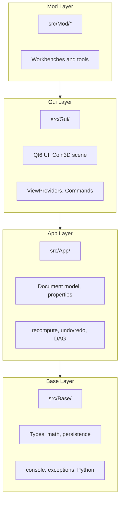
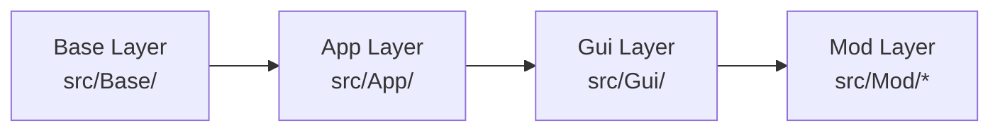
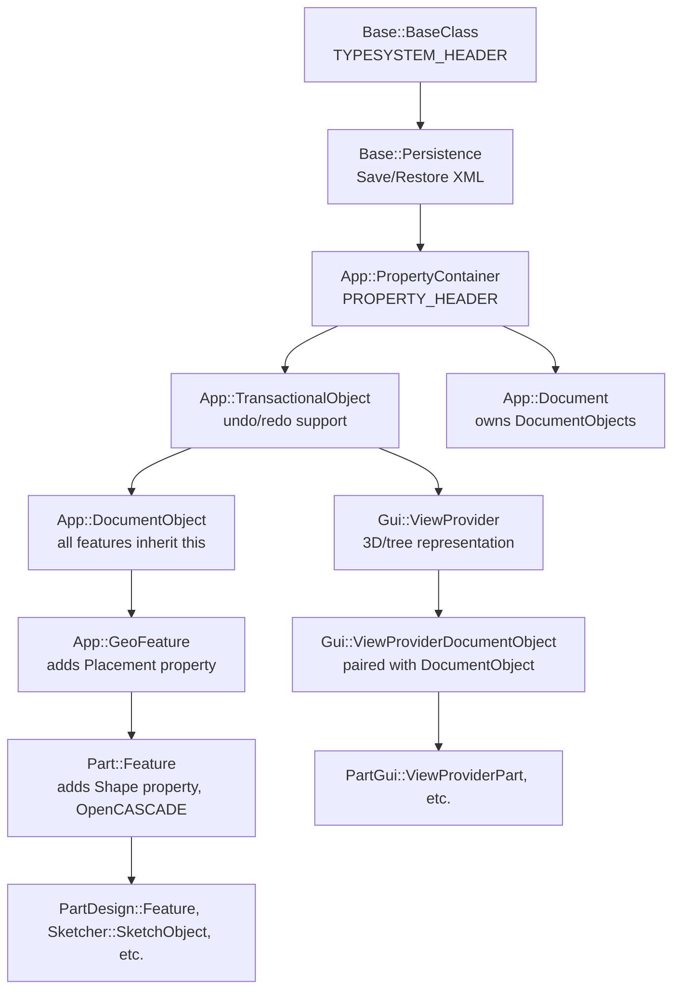

# FreeCAD Architecture Overview

FreeCAD is a 2.4M line open source parametric 3D CAD application.
It mixes C++ and Python, uses OpenCASCADE as the geometry kernel, Qt6 for the GUI, and Coin3D for 3D visualization.
This guide gives you a working mental model of the codebase before you dive into a specific subsystem.

You already know C++ and Python.
What you probably do not know yet is how FreeCAD keeps the core headless while still supporting a large GUI and many workbenches.

## The Big Picture

FreeCAD is built around a strict separation between:

- Data and logic (headless)
- Visualization and interaction (GUI)
- Pluggable workbenches that add features

That separation is enforced by a layered architecture.
Most confusion when reading FreeCAD for the first time comes from mixing up what belongs in which layer.

## Three Layer Architecture

Think in terms of layers, not folders.
The layer boundaries are the main design constraint.



### Base Layer (src/Base/)

Base is the foundation.
It provides the common runtime and utilities that everything else depends on.

Core responsibilities:

- Type system and runtime type information helpers
- Math utilities and geometry primitives, for example `Base::Vector3d`, `Base::Matrix4D`, `Base::Placement`, `Base::BoundBox`
- Persistence primitives, including XML serialization support
- Console logging and message routing
- Exception hierarchy used across the project
- Python interpreter initialization glue

Critical property:

- Base has ZERO Qt dependency

Why that matters:

- It is safe to use Base from headless tools and tests
- It keeps the lowest level portable and fast to build
- It allows `FreeCADCmd` to run without bringing up Qt

### App Layer (src/App/)

App is the headless document model.
If you want to understand FreeCAD as a parametric system, this is where to spend time.

Core responsibilities:

- `App::Document`: owns objects and orchestrates recompute
- `App::DocumentObject`: base class for features, parameters, and derived results
- Property system: typed properties, serialization, change notification
- `App::PropertyContainer`: base for anything that holds properties
- Extensions: composition mechanisms that attach extra behavior to objects
- Expression engine: expressions that drive properties and track dependencies
- Transaction system: undo/redo support
- Dependency graph: directed acyclic graph between objects and properties

Critical property:

- App also has ZERO Qt dependency

That is the key to headless operation.
If you can construct and recompute a document in App, it can run from CLI, from Python, or in tests.

### Gui Layer (src/Gui/)

Gui is the visualization and interaction layer.
It turns headless document objects into something you can see and manipulate.

Core responsibilities:

- Qt6 widgets, dialogs, docking system
- TaskView panels and interactive workflows
- Tree view and model presentation
- Selection system
- Command framework and action registration
- Coin3D (Open Inventor style) 3D scene graph
- `Gui::ViewProvider` classes that render `App::DocumentObject` instances

Dependencies:

- Depends on Qt6
- Depends on Coin3D and the Open Inventor scene graph concepts

### Mod Layer (src/Mod/)

Mod is where the 34 workbenches live.
Each workbench is a module that builds on Base, App, and sometimes Gui.

Typical workbench structure:

- `src/Mod/<Workbench>/App/` for document objects and algorithms
- `src/Mod/<Workbench>/Gui/` for view providers, commands, and UI
- Python entry points such as `Init.py` and `InitGui.py`

Some workbenches are primarily C++.
Some are primarily Python.
Most combine both.

## Strict Layer Dependency Rule

The layering is not just a guideline.
It is a hard dependency direction.

Sometimes written as:

Base ← App ← Gui ← Mod/\*



Rules:

- App must never import Qt
- Gui must never be imported by App
- Base must stay free of Qt

If you are reading code and see a class include, ask:

- Which layer owns this concept
- Is the dependency direction correct

When the direction is violated, headless mode breaks.
More subtly, it becomes impossible to run many tests or batch operations without a UI.

## Complete Class Hierarchy (Mental Model)

FreeCAD has a unified base class and property container concept.
Many important classes sit on top of each other in a deep hierarchy.
This is the backbone to keep in mind when you trace code.



Notes on reading this:

- `Base::BaseClass` gives runtime type information via FreeCAD macros
- `Base::Persistence` is the serialization hook into document storage
- `App::PropertyContainer` is the common base for anything that has properties
- `App::TransactionalObject` adds undo/redo integration
- `App::DocumentObject` is the core parametric element
- `App::GeoFeature` adds a `Placement` so the object can live in 3D space
- `Part::Feature` adds a `Shape` (an OpenCASCADE `TopoDS_Shape`) and is foundational for geometry
- `Gui::ViewProvider` is the GUI side representation

## DocumentObject and ViewProvider Pairing

Every `App::DocumentObject` has a corresponding `Gui::ViewProvider`.
This pairing is the bridge between headless logic and interactive visualization.

Conceptual split:

- App object owns data, parametric logic, recompute code, and persistence
- ViewProvider owns rendering, display modes, selection highlighting, and UI presentation

Connection point:

- The App object exposes a view provider name through `getViewProviderName()`

Why this is a big deal:

- App objects can be created, edited, and recomputed without any GUI
- The same App object can be displayed differently by different ViewProviders
- You can run batch scripts and unit tests headlessly

### Minimal C++ Sketch of the Pairing

The exact APIs vary per module, but the idea looks like this.

```cpp
// App side
class MyFeature : public App::DocumentObject
{
public:
    const char* getViewProviderName() const override
    {
        return "MyModuleGui::ViewProviderMyFeature";
    }

    // execute() computes derived data
    App::DocumentObjectExecReturn* execute() override;
};

// Gui side
class ViewProviderMyFeature : public Gui::ViewProviderDocumentObject
{
public:
    void attach(App::DocumentObject* obj) override;
    void updateData(const App::Property* prop) override;
    std::vector<std::string> getDisplayModes() const override;
};
```

You will see this pattern repeated across workbenches.
If you are tracking a bug, it often helps to decide whether it is:

- App side: wrong data, wrong recompute, wrong dependencies
- Gui side: wrong rendering, wrong interaction, wrong selection

## Directory Structure

FreeCAD is large.
The top level layout is deliberately organized around the layer boundaries and the module system.

```text
FreeCAD/
  src/
    Base/            Base layer, types, math, persistence
    App/             App layer, document model, properties, extensions
    Gui/             Gui layer, Qt6 and Coin3D visualization
    Mod/             Workbenches, features, commands, UI
    Main/            Entry points, GUI and headless binaries
    3rdParty/        Vendored libraries
    Ext/freecad/     Python utility shims
  tests/             C++ gtest and Python unittest, mirrors src layout
  tools/             Build, lint, profiling scripts
  cMake/             CMake modules and find scripts
  package/           Packaging machinery (conda, rattler-build)
  data/              Desktop files, MIME, AppStream metadata
```

What each directory is for:

- `src/Base/` contains the shared runtime foundation, with no Qt
- `src/App/` contains the document model, with no Qt
- `src/Gui/` contains the interactive GUI and rendering code
- `src/Mod/` contains pluggable workbenches such as Part, Sketcher, Fem, Draft, BIM
- `src/Main/` contains entry points: `MainGui.cpp`, `MainCmd.cpp` for headless, `MainPy.cpp` for the Python module
- `src/3rdParty/` contains vendored dependencies, for example OndselSolver, salomesmesh, PyCXX, zipios++
- `src/Ext/freecad/` contains Python shims and helper modules
- `tests/` contains test suites, often mirroring module layout
- `tools/` contains build and developer tooling scripts
- `cMake/` contains custom CMake find modules and project logic
- `package/` contains packaging recipes and integration

## Bootstrap Sequence

FreeCAD startup is a controlled pipeline.
It initializes the core runtime, then loads modules, then optionally brings up the GUI.

The high level sequence:

1. `main()` in `src/Main/MainGui.cpp` or `src/Main/MainCmd.cpp` (headless)
2. `App::Application::init()` registers type system classes, reads configuration, starts the embedded Python interpreter
3. `FreeCADInit.py` scans `src/Mod/` directories and runs each module's `Init.py`
4. `Gui::Application::initApplication()` registers ViewProvider types and loads Qt resources
5. `FreeCADGuiInit.py` runs each module's `InitGui.py` and registers workbench classes

### What Each Stage Gives You

Stage 1:

- Selects GUI or headless entry point
- Sets up platform level hooks

Stage 2:

- Core runtime is alive
- Type system is registered
- Python is available

Stage 3:

- Modules register their document objects, file formats, and Python APIs
- App layer becomes feature complete

Stage 4:

- GUI infrastructure is created
- ViewProviders can be instantiated
- Qt resources, icons, and translations become available

Stage 5:

- Workbenches appear in the UI
- Commands, toolbars, and menus are registered

This order is intentional.
It ensures that the App layer can be used without GUI.

### Headless Mode in Practice

Headless operation is not a special case.
It is the natural result of Base and App having no Qt.

Common headless activities:

- Batch recompute of documents
- Import/export conversions
- Geometry processing scripts
- Automated tests

The CLI entry point is built around the same document model.
The only difference is that Gui initialization is skipped.

## The Document Model

If you want a single sentence definition:

An `App::Document` owns a set of `App::DocumentObject` instances, each object has typed properties, and recompute derives new data by evaluating a dependency graph.

### Document

`App::Document` is a container plus an execution engine.

It is responsible for:

- Object lifetime and naming
- Recompute scheduling
- Transaction recording for undo/redo
- Serialization to and from the project file format

### DocumentObject

An `App::DocumentObject` is a node in the parametric model.

Common patterns:

- Inputs are stored in properties
- Outputs are stored in properties
- `execute()` recomputes outputs when inputs change

The key mental model is that objects do not directly push updates into each other.
They expose properties.
The document recompute machinery pulls and orders execution based on dependencies.

### Properties

Properties are how data is stored, displayed, serialized, and connected via expressions.
They are typed and have metadata.

Examples of property categories:

- Numeric values: lengths, angles
- Enumerations
- Links: references to other document objects
- Shapes and geometry data
- Lists and compound types

Minimal C++ sketch of adding a property:

```cpp
class MyObject : public App::DocumentObject
{
    PROPERTY_HEADER(MyObject);

public:
    App::PropertyLength Length;

    MyObject()
    {
        addProperty(&Length, "Length", "Parameters", "Input length");
    }
};
```

Minimal Python sketch of setting a property and recomputing:

```python
import FreeCAD as App

doc = App.newDocument()
box = doc.addObject("Part::Box", "Box")
box.Length = 10
doc.recompute()
```

Property changes drive recompute.
The recompute engine determines what needs to run.

### Dependency Graph (DAG)

FreeCAD tracks dependencies between objects so that recompute happens in a valid order.
The graph is directed.
Cycles are generally an error because they cannot be topologically ordered.

You will see dependencies coming from:

- Property links from one object to another
- Expressions referencing other properties
- Internally established relations in feature code

When debugging recompute bugs, ask:

- Is the dependency recorded correctly
- Is an object missing a link or expression reference
- Is execution happening in the wrong order

### Transactions and Undo/Redo

Undo/redo is integrated into the document model.
The transaction system records changes to objects and properties.

The key idea:

- Most edits happen inside a transaction
- Property changes and object creation are recorded
- Undo rewinds the document state and triggers recompute

This is why many document classes inherit from `App::TransactionalObject`.

### Extensions

Extensions let objects gain capabilities without deep inheritance.

Typical reasons to use an extension:

- Grouping behavior
- Link behavior
- Suppression, visibility, or feature toggling

If you see an object with behavior that does not appear in its class definition, check whether an extension is attached.

### Expression Engine

The expression engine allows properties to be defined as expressions referencing other properties.
This is one of the mechanisms that makes models parametric.

Key effects:

- An expression creates dependencies
- Recompute evaluates expressions and updates values
- Expressions interact with units and property types

If you see values update unexpectedly, check for expressions.

## Gui Concepts

The Gui layer is large, but its responsibilities are consistent.
It never owns the authoritative model.
It presents and manipulates App data.

### Coin3D Scene Graph

Coin3D is an Open Inventor compatible scene graph.
ViewProviders typically build subgraphs that represent the object.

You will see nodes such as:

- `SoSeparator` as a grouping node
- `SoCoordinate3` for point arrays
- `SoIndexedFaceSet` for indexed triangles or polygon faces

Minimal conceptual scene graph sketch:

```text
SoSeparator
  SoMaterial
  SoDrawStyle
  SoCoordinate3
  SoIndexedFaceSet
```

The scene graph is a data structure.
The viewer traverses it to draw.

### ViewProvider

`Gui::ViewProvider` is the abstraction that connects an App object to the GUI.

Common responsibilities:

- Create or update the Coin3D scene subgraph
- Provide display modes
- React to property changes via `updateData`
- Provide icon and tree view behavior
- Support selection and highlighting

When you are searching for visualization code, look for:

- `ViewProvider` subclasses in `src/Gui/` or `src/Mod/<Workbench>/Gui/`

### Selection System

Selection is a cross cutting concern.
It takes user picks in the 3D view or tree and resolves them to:

- A document object
- A sub element, for example a face, edge, or vertex
- A persistent identifier when possible

Many tools depend on selection behavior.
If a command seems broken, verify whether selection is reporting the expected target.

### Command Framework

Most interactive tools are implemented as commands.
Commands live in the GUI layer because they are about interaction.

Common command activities:

- Read selection
- Create or modify App objects
- Start a TaskView panel
- Trigger recompute

Even when a command lives in Gui, it should push actual model changes into App objects.
The GUI should not keep hidden state that affects the model.

## Workbenches

Workbenches are modules that package tools, features, and UI.
They are the main way FreeCAD scales to many domains.

### C++ Workbenches

C++ workbenches typically have compiled code in both:

- `src/Mod/<Name>/App/`
- `src/Mod/<Name>/Gui/`

Examples include Part, Sketcher, Fem.

You can expect to find:

- New `App::DocumentObject` subclasses
- ViewProviders for those objects
- Commands and UI

### Python Only Workbenches

Python focused workbenches often rely on the FeaturePython proxy pattern.
In this model:

- The document object is a generic host
- A Python proxy object implements behavior
- A Python view provider implements visualization if needed

Examples include Draft, BIM, AddonManager.

Minimal Python FeaturePython sketch:

```python
import FreeCAD as App

class MyProxy:
    def __init__(self, obj):
        obj.addProperty("App::PropertyLength", "Length", "Parameters", "Input length")
        obj.Proxy = self

    def execute(self, obj):
        # compute outputs based on inputs
        pass

def make():
    doc = App.ActiveDocument
    obj = doc.addObject("App::FeaturePython", "MyObject")
    MyProxy(obj)
    doc.recompute()
    return obj
```

This pattern keeps the headless document model intact.
The Python proxy still runs inside the App layer context.

## Workbench Dependency Graph

Not all workbenches are independent.
Many build on Part because Part is the bridge to OpenCASCADE.

The common dependency direction:

- Part is the foundation, almost everything depends on it
- Sketcher builds on Part
- PartDesign builds on Sketcher and Part
- Draft builds on Part
- BIM builds on Draft and Part
- Mesh and Fem interact, both often depend on Part
- TechDraw, CAM, Assembly typically depend on Part

One way to picture it:

```text
Part
  |\
  | +-> Sketcher -> PartDesign
  |
  +-> Draft -> BIM
  |
  +-> Mesh -> Fem
  |
  +-> TechDraw
  +-> CAM
  +-> Assembly
```

This is not a formal graph.
It is a practical reading order.
If you understand Part and the document model, most other modules will feel familiar.

## Key Technologies

FreeCAD integrates several large external libraries.
Understanding what each one is responsible for helps you avoid searching in the wrong place.

### OpenCASCADE (OCCT)

OCCT is the geometry kernel.
It provides the boundary representation data structures and algorithms.

Important concepts:

- `TopoDS_Shape` as the generic topological shape
- BRep operations for boolean, fillet, chamfer, offset
- STEP and IGES import and export

In FreeCAD, OCCT is mostly wrapped by the Part workbench.
If you see code manipulating `TopoDS_*` types, you are usually in Part or a module that builds on it.

### Coin3D

Coin3D is an Open Inventor compliant scene graph implementation.
It provides the 3D rendering data model used by the viewer.

Important nodes:

- `SoSeparator` for grouping
- `SoCoordinate3` for vertices
- `SoIndexedFaceSet` for faces

In FreeCAD, Coin3D is mainly used in the Gui layer and in workbench ViewProviders.

### Qt6

Qt6 is the GUI framework.
It provides:

- Widgets and windowing
- Signals and slots
- UI definitions in `.ui` files
- Translation infrastructure

Qt belongs to the Gui layer.
If you see Qt types in a file that should be headless, the layering rule is being violated.

### Python

Python is embedded as a scripting language.
It is not just for macros.
It is part of the architecture.

Python is used for:

- Scripting API for document creation and editing
- Macro recording and automation
- Implementing workbenches and commands
- FeaturePython parametric objects

Python calls into App and Gui through bindings.
The goal is that most modeling logic remains in App objects, regardless of whether they are implemented in C++ or Python.

### Boost

Boost appears throughout the codebase.
Common uses include:

- Smart pointers
- Filesystem utilities
- Legacy signals and generic helpers
- `boost::any` in older areas

When reading code, treat Boost usage as implementation detail.
The architectural boundary is still the FreeCAD layers.

## Where to Start

This section maps common developer intents to where you should read first.

### Add a New Feature to an Existing Workbench

Start in:

- `src/Mod/<Name>/App/` for C++ document objects and algorithms
- A FeaturePython implementation if the workbench is Python centric

Focus on:

- The `App::DocumentObject` subclass or proxy
- Which properties represent inputs and outputs
- The `execute()` recompute behavior

### Add a GUI Command

Start in:

- `src/Mod/<Name>/Gui/Command*.cpp` for C++
- The workbench's Python command registration for Python

Focus on:

- How the command reads selection
- Which document objects it creates or edits
- How it triggers recompute

### Fix a Core Bug

Decide which layer owns the bug:

- Base: types, math, persistence, logging, exceptions
- App: document model, property semantics, recompute, undo/redo
- Gui: visualization, selection, command interaction

Start in:

- `src/App/` for document and property issues
- `src/Base/` for type system or serialization issues

### Add a New Workbench

Start by studying the TemplatePyMod pattern.
It shows the module bootstrap structure with `Init.py` and `InitGui.py` and a minimal FeaturePython pattern.

Look in:

- `src/Mod/TemplatePyMod/`

### Add a New Property Type

Start in:

- `src/App/Property*.h`

Focus on:

- How the property stores data
- How it serializes
- How it emits change notifications
- How it interacts with expressions

### Write Tests

Pick the test type based on the layer:

- C++ tests live in `tests/src/` and usually use gtest
- Python tests live in `src/Mod/Test/` and use unittest

If you are testing headless logic, prefer tests that do not require Gui.
That is usually faster and easier to run.

## Reading Tips (Architecture First)

When you open a file, do these quick checks:

- Which layer is this directory in
- Does it include Qt headers
- Does it build a Coin3D scene graph
- Does it define a `DocumentObject` or a `ViewProvider`

Then follow the data flow:

- Properties define inputs and outputs
- Document recompute calls `execute()` on affected objects
- ViewProviders react to property changes to update visualization

If you keep those three points in mind, the codebase becomes much more navigable.

## Glossary

Document:

- A container of objects plus recompute and undo/redo machinery

DocumentObject:

- A parametric node with properties and recompute behavior

Property:

- A typed, serializable field with change tracking

Recompute:

- The process of evaluating dependencies and executing objects to update derived data

ViewProvider:

- GUI representation of a DocumentObject, responsible for scene graph and presentation

Workbench:

- A module that packages features, commands, and UI for a domain

## What This Guide Did Not Cover

This entry document focuses on architecture.
It intentionally does not dive into:

- Individual workbench feature sets
- File formats and import/export details
- Specific UI workflows
- Any development workflow topics

Those topics belong in later guides once the layer model is familiar.
