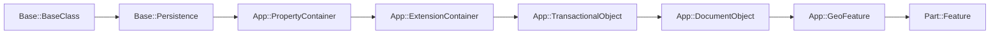

<!--
FreeCAD Developer Guide 03
Document Objects

Scope: DocumentObject lifecycle, execution model, dependency graph.
Assumes: you know guides 01-02 (layers, type system, properties).
-->

# 03. Document Objects

`App::DocumentObject` is the parametric node type: properties hold inputs/outputs, and the document
recompute engine orders and invokes objects based on a dependency DAG.

## 1. DocumentObject Class Hierarchy

Mental model:



Concrete `DocumentObject` definition (showing the key overridables):

`src/App/DocumentObject.h`:

```cpp
class AppExport DocumentObject: public App::TransactionalObject
{
    PROPERTY_HEADER_WITH_OVERRIDE(App::DocumentObject);
public:
    virtual const char* getViewProviderName() const { return ""; }
    virtual short mustExecute() const;
protected:
    virtual App::DocumentObjectExecReturn* execute();
    void onChanged(const Property* prop) override;
};
```

`Part::Feature` (via `App::GeoFeature`) adds `Shape`:

`src/Mod/Part/App/PartFeature.cpp`:

```cpp
Feature::Feature() { ADD_PROPERTY(Shape, (TopoDS_Shape())); }
```

## 2. DocumentObject Lifecycle

### 2.1 Creation: Document::addObject() and \_addObject()

`src/App/Document.cpp` (trimmed):

```cpp
const Base::Type type =
    Base::Type::getTypeIfDerivedFrom(sType, DocumentObject::getClassTypeId(), true);
if (type.isBad()) {
    std::stringstream str;
    str << "Document::addObject: '" << sType << "' is not a document object type";
    throw Base::TypeError(str.str());
}
void* typeInstance = type.createInstance();
if (!typeInstance) {
    return nullptr;
}
auto* pcObject = static_cast<DocumentObject*>(typeInstance);
pcObject->setDocument(this);
_addObject(pcObject, pObjectName, /* options */, viewType);
return pcObject;
```

Insertion assigns name/label, calls `setupObject()` for new objects, and sets status bits.

`src/App/Document.cpp` sets up and marks new objects via:
`pcObject->setupObject();` and `pcObject->setStatus(ObjectStatus::New, true);`.

### 2.2 Property registration happens in constructors

`src/App/DocumentObject.cpp`:

```cpp
DocumentObject::DocumentObject()
    : ExpressionEngine()
{
    ADD_PROPERTY_TYPE(Label, ("Unnamed"), "Base", Prop_Output, "User name of the object (UTF8)");
    ADD_PROPERTY_TYPE(ExpressionEngine, (), "Base", Prop_Hidden, "Property expressions");
    ADD_PROPERTY(Visibility, (true));
}
```

### 2.3 Initial state and status bits

`src/App/DocumentObject.h` defines status bit positions:

```cpp
enum ObjectStatus
{
    Touch = 0,
    Error = 1,
    New = 2,
    Recompute = 3,
    Restore = 4,
    Remove = 5,
    Destroy = 7,
    Enforce = 8,
    PendingRecompute = 11,
    NoTouch = 14,
    Freeze = 21,
};
```

### 2.4 Deletion: removeObject() -> unsetupObject() -> breakDependency()

Deletion is document-owned, and includes link cleanup.

`src/App/Document.cpp`:

```cpp
pcObject->setStatus(ObjectStatus::Remove, true);
if (!d->undoing && !d->rollback) {
    pcObject->unsetupObject();
}
signalDeletedObject(*pcObject);
breakDependency(pcObject, true);
tobedestroyed->setStatus(ObjectStatus::Destroy, true);
```

## 3. The execute() Method (Computation)

`src/App/DocumentObject.cpp`:

```cpp
DocumentObjectExecReturn* DocumentObject::execute()
{
    return executeExtensions();
}
```

Recompute calls `DocumentObject::recompute()`, which sets the `Recompute` status via
`ObjectStatusLocker`, calls `execute()`, and runs extensions as needed.

`src/App/DocumentObject.cpp`:

```cpp
Base::ObjectStatusLocker<ObjectStatus, DocumentObject> exe(App::Recompute, this);
auto ret = this->execute();
if (ret == StdReturn && this->testStatus(App::RecomputeExtension)) {
    ret = executeExtensions();
}
```

### 3.1 Return convention: StdReturn is nullptr

`src/App/DocumentObject.cpp`:

```cpp
DocumentObjectExecReturn* DocumentObject::StdReturn = nullptr;
```

### 3.2 Concrete example: Part::Feature bookkeeping

`src/Mod/Part/App/PartFeature.cpp`:

```cpp
App::DocumentObjectExecReturn* Feature::execute()
{
    this->Shape.touch();
    return GeoFeature::execute();
}
```

### 3.3 Concrete example: compute shape, write Shape, return StdReturn

`src/Mod/Part/App/FeatureExtrusion.cpp`:

```cpp
App::DocumentObjectExecReturn* Extrusion::execute()
{
    App::DocumentObject* link = Base.getValue();
    if (!link) {
        return new App::DocumentObjectExecReturn("No object linked");
    }

    try {
        ExtrusionParameters params = computeFinalParameters();
        TopoShape result(0, getDocument()->getStringHasher());
        extrudeShape(result,
                     Feature::getTopoShape(link, ShapeOption::ResolveLink | ShapeOption::Transform),
                     params);
        this->Shape.setValue(result);
        return App::DocumentObject::StdReturn;
    }
    catch (Standard_Failure& e) {
        return new App::DocumentObjectExecReturn(e.GetMessageString());
    }
}
```

Rule: never call `execute()` directly. Use `doc->recompute()` or `obj->recomputeFeature()`.

## 4. The mustExecute() Method (Dirty Detection)

`src/App/DocumentObject.cpp`:

```cpp
short DocumentObject::mustExecute() const
{
    if (ExpressionEngine.isTouched()) {
        return 1;
    }
    auto vector = getExtensionsDerivedFromType<App::DocumentObjectExtension>();
    for (auto ext : vector) {
        if (ext->extensionMustExecute()) {
            return 1;
        }
    }
    return 0;
}
```

Typical override uses `Property::isTouched()` for input properties.

`src/Mod/Part/App/FeaturePartBox.cpp`:

```cpp
short Box::mustExecute() const
{
    if (Length.isTouched() || Height.isTouched() || Width.isTouched()) {
        return 1;
    }
    return Primitive::mustExecute();
}
```

## 5. The DAG (Dependency Graph)

`src/App/DocumentObject.h`:

```cpp
const std::vector<App::DocumentObject*>& getOutList() const;
const std::vector<App::DocumentObject*>& getInList() const;
// plus recursive helpers (getOutListRecursive/getInListRecursive)
```

### 5.1 OutList is derived from links and expressions

OutList is computed by scanning properties for `PropertyLinkBase` and adding expression links.

`src/App/DocumentObject.cpp`:

```cpp
for (auto prop : props) {
    auto link = freecad_cast<PropertyLinkBase*>(prop);
    if (link) {
        link->getLinks(res, noHidden);
    }
}
ExpressionEngine.getLinks(res);
```

Example: `Part::Extrusion` introduces a link dependency by exposing a link property `Base`:

`src/Mod/Part/App/FeatureExtrusion.cpp`:

```cpp
ADD_PROPERTY_TYPE(Base, (nullptr), "Extrude", App::Prop_None, "Shape to extrude");
```

### 5.2 InList is maintained as back-links

`src/App/DocumentObject.cpp`:

```cpp
const std::vector<App::DocumentObject*>& DocumentObject::getInList() const
{
    return _inList;
}

void App::DocumentObject::_addBackLink(DocumentObject* newObj)
{
    _inList.push_back(newObj);
}
```

### 5.3 Global ordering: Document topological sort + cycle reporting

`src/App/Document.cpp`:

```cpp
try {
    boost::topological_sort(depList, std::front_inserter(make_order));
}
catch (const std::exception& e) {
    if ((options & DepNoCycle) != 0) {
        boost::strong_components(depList, /* ... */);
        FC_THROWM(Base::RuntimeError, e.what());
    }
    ret = DocumentP::partialTopologicalSort(objs);
    std::reverse(ret.begin(), ret.end());
    return ret;
}
```

### 5.4 Tracing dependencies through a chain

Recursive traversal is depth-limited and follows OutList edges.

`src/App/DocumentObject.cpp`:

```cpp
for (const auto objIt : obj->getOutList()) {
    if (objIt == checkObj || depth <= 0) {
        throw Base::BadGraphError(
            "DocumentObject::getOutListRecursive(): cyclic dependency detected!");
    }
    auto pair = objSet.insert(objIt);
    if (pair.second) { _getOutListRecursive(objSet, objIt, checkObj, depth - 1); }
}
```

## 6. The onChanged() Callback

The base implementation is where Touch/Enforce is set from property flags, the document is
notified, and signals fire.

`src/App/DocumentObject.cpp`:

```cpp
if (!testStatus(ObjectStatus::NoTouch) && !(prop->getType() & Prop_Output)
    && !prop->testStatus(Property::Output)) {
    StatusBits.set(ObjectStatus::Touch);
    if (!(prop->getType() & Prop_NoRecompute)) {
        StatusBits.set(ObjectStatus::Enforce);
    }
}
TransactionalObject::onChanged(prop);
if (_pDoc) {
    _pDoc->onChangedProperty(this, prop);
}
signalChanged(*this, *prop);
```

### 6.1 Placement example with parent call

`src/Mod/Fem/App/FemPostObject.cpp`:

```cpp
void FemPostObject::onChanged(const App::Property* prop)
{
    if (prop == &Placement) {
        this->touch();
    }
    App::GeoFeature::onChanged(prop);
}
```

## 7. Status Bits and Object State

Key helpers (excerpt) from `src/App/DocumentObject.h`:

```cpp
void purgeTouched()
{
    StatusBits.reset(ObjectStatus::Touch);
    StatusBits.reset(ObjectStatus::Enforce);
    setPropertyStatus(0, false);
}
```

Touch is observable by the document:
`src/App/DocumentObject.cpp` uses `touch()` to also call `_pDoc->signalTouchedObject(*this);`.

Status propagation to dependents during recompute (`src/App/Document.cpp`):

```cpp
for (auto inObjIt : obj->getInList()) {
    inObjIt->enforceRecompute();
}
```

## 8. Object Naming and Labeling

`src/App/DocumentObject.cpp`:

```cpp
const char* DocumentObject::getNameInDocument() const
{
    if (!pcNameInDocument) {
        return nullptr;
    }
    return pcNameInDocument->c_str();
}
```

## 9. The recompute() Flow (Step-by-Step)

1. User changes a property value.
2. The property notifies its container (`DocumentObject::onChanged()`).
3. `DocumentObject::onChanged()` sets Touch/Enforce (unless output/no-touch).
4. `Document::recompute()` gathers candidates and sorts the DAG (topological order).
5. For each object: `mustRecompute()` checks Enforce and `mustExecute()`.
6. `DocumentObject::recompute()` runs and calls `execute()`.
7. `execute()` reads inputs, computes, writes outputs (properties).
8. `purgeTouched()` clears Touch/Enforce and resets property status.
9. Signals fire (`signalRecomputedObject`, `signalRecomputed`, `signalChanged`).

Core loop (more trimmed):

`src/App/Document.cpp`:

```cpp
auto topoSortedObjects =
    getDependencyList(objs.empty() ? d->objectArray : objs, DepSort | options);

for (; idx < topoSortedObjects.size(); ++idx) {
    auto obj = topoSortedObjects[idx];
    if (obj->mustRecompute()) {
        (void)_recomputeFeature(obj);
    }
    if (obj->isTouched()) {
        obj->purgeTouched();
        for (auto inObjIt : obj->getInList()) { inObjIt->enforceRecompute(); }
    }
}
```

## 10. DocumentObject Signals

Current source uses `fastsignals::signal` (not `boost::signals2`) for per-object property events.

`src/App/DocumentObject.h`:

```cpp
fastsignals::signal<void(const App::DocumentObject&, const App::Property&)> signalBeforeChange;
fastsignals::signal<void(const App::DocumentObject&, const App::Property&)> signalChanged;
fastsignals::signal<void(const App::DocumentObject&, const App::Property&)> signalEarlyChanged;
```

Firing site example in `src/App/DocumentObject.cpp`:

```cpp
signalChanged(*this, *prop);
```

## 11. Practical Example: Minimal Custom DocumentObject

Minimal skeleton showing property registration, dirty detection, execute, and onChanged.

```cpp
// MyFeature.h
// SPDX-License-Identifier: LGPL-2.1-or-later
#include <App/DocumentObject.h>
#include <App/PropertyStandard.h>
#include <App/PropertyUnits.h>
namespace MyMod
{
class MyExport MyFeature : public App::DocumentObject
{
    PROPERTY_HEADER_WITH_OVERRIDE(MyMod::MyFeature);
public:
    MyFeature();
    App::PropertyLength Length;
    App::PropertyInteger Count;
    short mustExecute() const override;
    App::DocumentObjectExecReturn* execute() override;
    void onChanged(const App::Property* prop) override;
};
}
```

```cpp
// MyFeature.cpp
// SPDX-License-Identifier: LGPL-2.1-or-later
#include <PreCompiled.h>
#include <Mod/MyMod/App/MyFeature.h>
using namespace MyMod;
PROPERTY_SOURCE(MyMod::MyFeature, App::DocumentObject)
MyFeature::MyFeature()
{
    ADD_PROPERTY_TYPE(Length, (10.0), "Base", App::Prop_None, "Length");
    ADD_PROPERTY_TYPE(Count, (5), "Base", App::Prop_None, "Count");
}
short MyFeature::mustExecute() const
{
    if (Length.isTouched() || Count.isTouched()) {
        return 1;
    }
    return App::DocumentObject::mustExecute();
}
App::DocumentObjectExecReturn* MyFeature::execute()
{
    (void)Length.getValue();
    (void)Count.getValue();
    return App::DocumentObject::StdReturn;
}
void MyFeature::onChanged(const App::Property* prop)
{
    if (prop == &Length || prop == &Count) {}
    App::DocumentObject::onChanged(prop);
}
```
