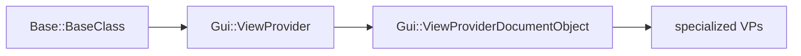

<!--
SPDX-License-Identifier: LGPL-2.1-or-later

FreeCAD Developer Guide 05
GUI, ViewProviders, and Commands

Audience: developers who know DocumentObjects and want to add UI.
Scope: ViewProvider hierarchy, scene graph, command framework, selection, task panels.
-->

# 05. GUI, ViewProviders, and Commands

The Gui layer (`src/Gui/`) provides 3D visualization, the tree view, task panels, and selection.
Every `App::DocumentObject` has a paired `Gui::ViewProvider` for visualization.

Key files:

- `src/Gui/ViewProvider.h`
- `src/Gui/ViewProviderDocumentObject.h`
- `src/Gui/Command.h`
- `src/Gui/Selection.h`
- `src/Gui/TaskView/TaskDialog.h`

## 1. ViewProvider Class Hierarchy



`ViewProviderDocumentObject` pairs with one `App::DocumentObject`:

```cpp
// src/Gui/ViewProviderDocumentObject.h
class GuiExport ViewProviderDocumentObject : public ViewProvider {
public:
    App::DocumentObject* getObject() const;
    virtual void attach(App::DocumentObject* obj);
    virtual void updateData(const App::Property* prop);
    virtual void onChanged(const App::Property* prop);
};
```

Connection: `DocumentObject::getViewProviderName()` returns the ViewProvider type name.

## 2. ViewProvider Core Responsibilities

```cpp
// src/Gui/ViewProvider.h
class GuiExport ViewProvider : public Base::BaseClass {
public:
    virtual void attach(App::DocumentObject* obj);           // Build scene graph
    virtual void updateData(const App::Property* prop);        // React to data changes
    virtual std::vector<std::string> getDisplayModes() const; // Available modes
    virtual void setDisplayMode(const char* mode);            // Switch mode
    virtual QIcon getIcon() const;                            // Tree view icon
    virtual void setupContextMenu(QMenu* menu, QObject* receiver, const char* member);
    virtual bool setEdit(int ModNum);                         // Enter edit mode
    virtual void unsetEdit(int ModNum);                       // Leave edit mode
};
```

## 3. Coin3D Scene Graph Basics

ViewProviders build an Open Inventor scene graph using Coin3D:

```cpp
void ViewProviderMyFeature::attach(App::DocumentObject* obj) {
    ViewProviderDocumentObject::attach(obj);

    SoSeparator* root = new SoSeparator();
    root->ref();  // Reference counting

    // Coordinates for geometry
    SoCoordinate3* coords = new SoCoordinate3();
    root->addChild(coords);

    // Face set for rendering
    SoIndexedFaceSet* faces = new SoIndexedFaceSet();
    root->addChild(faces);

    // Material
    SoMaterial* mat = new SoMaterial();
    mat->diffuseColor.setValue(0.8f, 0.8f, 0.8f);
    root->addChild(mat);

    // Register display mode
    addDisplayMaskMode(root, "Shaded");
    setDisplayMaskMode("Shaded");
}
```

Common Coin3D nodes:

- `SoSeparator` — Group node
- `SoCoordinate3` — Vertex coordinates
- `SoIndexedFaceSet` — Faces
- `SoLineSet` — Wireframe edges
- `SoMaterial` — Colors
- `SoTransform` — Position/rotation

## 4. updateData() Implementation

React when properties change:

```cpp
void ViewProviderMyFeature::updateData(const App::Property* prop) {
    MyFeature* feature = static_cast<MyFeature*>(getObject());

    if (prop == &feature->Shape) {
        // Update Coin3D geometry from Shape property
        updateGeometryFromShape(feature->Shape.getValue());
    }
    else if (prop == &feature->Placement) {
        // Update transform node
        updatePlacement(feature->Placement.getValue());
    }

    ViewProviderDocumentObject::updateData(prop);  // Call parent
}
```

## 5. The Command Framework

Commands are actions users invoke via menus, toolbars, or shortcuts.

```cpp
// src/Gui/Command.h
class GuiExport Command : public Base::BaseClass {
public:
    const char* getName() const;
    virtual void activated(int iMsg) = 0;     // Execute command
    virtual bool isActive() = 0;              // Enable/disable

    // Metadata set in constructor
    const char* sAppModule;    // Module name
    const char* sGroup;        // Command group
    const char* sMenuText;     // Menu label
    const char* sToolTipText;  // Tooltip
    const char* sStatusTip;    // Status bar text
    const char* sPixmap;       // Icon name
    const char* sAccel;        // Keyboard shortcut
};
```

## 6. Adding a GUI Command (C++)

```cpp
// CommandMyMod.h
#ifndef COMMANDMYMOD_H
#define COMMANDMYMOD_H

#include <Gui/Command.h>

class CmdMyModCreateBox : public Gui::Command {
public:
    CmdMyModCreateBox();
    void activated(int iMsg) override;
    bool isActive() override;
};

void CreateMyModCommands();

#endif

// CommandMyMod.cpp
#include "PreCompiled.h"
#include "CommandMyMod.h"
#include <Gui/Application.h>
#include <Gui/BitmapFactory.h>

using namespace Gui;

CmdMyModCreateBox::CmdMyModCreateBox() : Command("MyMod_CreateBox") {
    sAppModule = "MyMod";
    sGroup = "MyMod";
    sMenuText = QT_TR_NOOP("Create Box");
    sToolTipText = QT_TR_NOOP("Create a parametric box");
    sStatusTip = sToolTipText;
    sPixmap = "Part_Box";
    sAccel = "Ctrl+B";
}

void CmdMyModCreateBox::activated(int iMsg) {
    openCommand("Create Box");
    doCommand(Doc, "App.ActiveDocument().addObject('MyMod::MyFeature', 'Box')");
    commitCommand();
    updateActive();
}

bool CmdMyModCreateBox::isActive() {
    return hasActiveDocument();
}

void CreateMyModCommands() {
    Gui::Application::Instance->commandManager().addCommand(new CmdMyModCreateBox());
}
```

## 7. Adding a GUI Command (Python)

```python
import FreeCAD as App
import FreeCADGui as Gui

class CmdCreateBox:
    def GetResources(self):
        return {
            'Pixmap': 'Part_Box',
            'MenuText': 'Create Box',
            'ToolTip': 'Create a parametric box',
            'Accel': 'Ctrl+B'
        }

    def Activated(self):
        doc = App.ActiveDocument
        obj = doc.addObject("MyMod::MyFeature", "Box")
        doc.recompute()

    def IsActive(self):
        return App.ActiveDocument is not None

Gui.addCommand('MyMod_CreateBox', CmdCreateBox())
```

## 8. Menu and Toolbar Registration

In C++ workbench:

```cpp
void Workbench::setupMenu() {
    Gui::MenuItem* root = new Gui::MenuItem;
    Gui::MenuItem* myMod = new Gui::MenuItem;
    myMod->setCommand("&MyMod");
    *root << myMod;

    Gui::MenuItem* create = new Gui::MenuItem;
    create->setCommand("Create");
    *create << "MyMod_CreateBox" << "MyMod_CreateCylinder";
    *myMod << create;

    Gui::Application::Instance->commandManager().addToMenu("MyMod", root);
}

void Workbench::setupToolbars() {
    Gui::ToolBarItem* root = new Gui::ToolBarItem;
    Gui::ToolBarItem* tb = new Gui::ToolBarItem;
    tb->setCommand("MyMod");
    *tb << "MyMod_CreateBox" << "MyMod_CreateCylinder";
    *root << tb;

    Gui::Application::Instance->commandManager().addToToolBar("MyMod", root);
}
```

In Python workbench:

```python
class MyWorkbench(Gui.Workbench):
    def Initialize(self):
        self.appendMenu("MyMod", ["MyMod_CreateBox", "MyMod_CreateCylinder"])
        self.appendToolbar("MyMod", ["MyMod_CreateBox", "MyMod_CreateCylinder"])
```

## 9. Task Panels

Task panels appear in the left sidebar during editing:

```cpp
// TaskDlgMyFeature.h
#ifndef TASKDLGMYFEATURE_H
#define TASKDLGMYFEATURE_H

#include <Gui/TaskView/TaskDialog.h>
#include <Gui/TaskView/TaskView.h>

class ViewProviderMyFeature;

class TaskDlgMyFeature : public Gui::TaskView::TaskDialog {
public:
    explicit TaskDlgMyFeature(ViewProviderMyFeature* vp);
    bool accept() override;  // OK clicked
    bool reject() override;  // Cancel clicked
    QDialogButtonBox::StandardButtons getStandardButtons() const override {
        return QDialogButtonBox::Ok | QDialogButtonBox::Cancel;
    }
};

#endif

// In ViewProvider:
bool ViewProviderMyFeature::setEdit(int ModNum) {
    Gui::Control().showDialog(new TaskDlgMyFeature(this));
    return true;
}

void ViewProviderMyFeature::unsetEdit(int ModNum) {
    Gui::Control().closeDialog();
}
```

## 10. Selection System

```cpp
// src/Gui/Selection.h
class GuiExport SelectionSingleton {
public:
    void addSelection(const char* docName, const char* objName, const char* subName = nullptr);
    void clearSelection(const char* docName = nullptr);
    std::vector<SelectionObject> getSelection() const;
    std::vector<SelectionObject> getSelectionEx() const;  // With sub-elements

    // Observer pattern
    void addObserver(SelectionObserver* obs);
    void removeObserver(SelectionObserver* obs);
};

Gui::Selection().addSelection("MyDoc", "Box", "Face1");
Gui::Selection().clearSelection();
auto sel = Gui::Selection().getSelection();
```

Observer pattern:

```cpp
class MyObserver : public Gui::SelectionObserver {
public:
    MyObserver() : SelectionObserver(true) {}

    void onSelectionChanged(const Gui::SelectionChanges& msg) override {
        if (msg.Type == Gui::SelectionChanges::AddSelection) {
            // Handle new selection
        }
    }
};
```

## 11. Tree View Customization

The tree view (`src/Gui/Tree.cpp`) displays DocumentObjects. ViewProviders control appearance:

```cpp
// Tree icon
QIcon ViewProviderMyFeature::getIcon() const {
    return Gui::BitmapFactory().pixmap("MyMod_Box");
}

// Context menu
void ViewProviderMyFeature::setupContextMenu(QMenu* menu, QObject* receiver, const char* member) {
    menu->addAction("Custom Action", receiver, member);
    ViewProviderDocumentObject::setupContextMenu(menu, receiver, member);
}

// Claim children (appear as tree nodes under this object)
std::vector<App::DocumentObject*> ViewProviderMyFeature::claimChildren() const {
    std::vector<App::DocumentObject*> children;
    MyFeature* feature = static_cast<MyFeature*>(getObject());
    if (feature->SubFeature.getValue()) {
        children.push_back(feature->SubFeature.getValue());
    }
    return children;
}

// Drag and drop
bool ViewProviderMyFeature::canDragObjects() const { return true; }
bool ViewProviderMyFeature::canDropObjects() const { return true; }
void ViewProviderMyFeature::dropObject(App::DocumentObject* obj) {
    // Handle dropped object
}
```

## 12. Display Modes

```cpp
std::vector<std::string> ViewProviderMyFeature::getDisplayModes() const {
    std::vector<std::string> modes;
    modes.push_back("Shaded");
    modes.push_back("Wireframe");
    modes.push_back("Points");
    return modes;
}

void ViewProviderMyFeature::setDisplayMode(const char* mode) {
    if (strcmp(mode, "Wireframe") == 0) {
        setDisplayMaskMode("Wireframe");
    } else {
        setDisplayMaskMode("Shaded");
    }
    ViewProviderGeometryObject::setDisplayMode(mode);
}
```

## 13. Icon and Resource System

Icons are stored in `Resources/icons/` or referenced by name:

```cpp
// Use existing FreeCAD icon
sPixmap = "Part_Box";

// Custom icon - register in module
Gui::BitmapFactory().addXPM("MyMod_Box", myBoxIconXPM);
```

.qrc file for resources:

```xml
<RCC>
    <qresource prefix="/icons">
        <file>MyMod_Box.svg</file>
    </qresource>
</RCC>
```

## 14. Complete Minimal ViewProvider Example

```cpp
// ViewProviderMyFeature.h
#ifndef VIEWPROVIDERMYFEATURE_H
#define VIEWPROVIDERMYFEATURE_H

#include <Gui/ViewProviderGeometryObject.h>

namespace MyModGui {

class ViewProviderMyFeature : public Gui::ViewProviderGeometryObject {
    PROPERTY_HEADER_WITH_OVERRIDE(MyModGui::ViewProviderMyFeature);

public:
    ViewProviderMyFeature();
    ~ViewProviderMyFeature() override;

    void attach(App::DocumentObject* obj) override;
    void updateData(const App::Property* prop) override;
    QIcon getIcon() const override;
    std::vector<std::string> getDisplayModes() const override;
};

} // namespace MyModGui

#endif

// ViewProviderMyFeature.cpp
#include "PreCompiled.h"
#include "ViewProviderMyFeature.h"
#include "MyFeature.h"
#include <Gui/Application.h>
#include <Gui/BitmapFactory.h>

using namespace MyModGui;

PROPERTY_SOURCE(MyModGui::ViewProviderMyFeature, Gui::ViewProviderGeometryObject)

ViewProviderMyFeature::ViewProviderMyFeature() {}
ViewProviderMyFeature::~ViewProviderMyFeature() {}

void ViewProviderMyFeature::attach(App::DocumentObject* obj) {
    ViewProviderGeometryObject::attach(obj);
    // Coin3D setup happens in base Part ViewProvider
}

void ViewProviderMyFeature::updateData(const App::Property* prop) {
    MyFeature* feature = static_cast<MyFeature*>(getObject());
    if (prop == &feature->Shape) {
        // Geometry updated - base class handles it
    }
    ViewProviderGeometryObject::updateData(prop);
}

QIcon ViewProviderMyFeature::getIcon() const {
    return Gui::BitmapFactory().pixmap("MyMod_Box");
}

std::vector<std::string> ViewProviderMyFeature::getDisplayModes() const {
    return {"Shaded", "Wireframe"};
}
```

## Key Takeaways

1. Every DocumentObject needs a ViewProvider for visualization
2. ViewProviders build Coin3D scene graphs in `attach()`
3. `updateData()` reacts to property changes
4. Commands use the Command framework with metadata + `activated()`
5. Task panels provide rich editing UI via `setEdit()`/`unsetEdit()`
6. Selection works via `Gui::Selection()` singleton + observers
7. Tree view appearance controlled by ViewProvider methods
8. Display modes control how objects render (Shaded, Wireframe, etc.)
