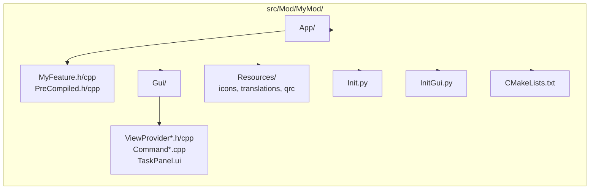

<!--
SPDX-License-Identifier: LGPL-2.1-or-later

FreeCAD Developer Guide 06
Workbench Development (structure, Init.py/InitGui.py, registration patterns)

Audience: FreeCAD C++ and Python developers who already understand DocumentObjects,
ViewProviders, and Commands.
Scope: How workbenches are organized and registered. No step-by-step workbench creation.
-->

# 06. Workbench Development

FreeCAD workbenches live in `src/Mod/` and package features, commands, and UI for a
specific domain. This guide explains the common directory layout, what `Init.py` and
`InitGui.py` do, and the registration patterns used by both C++ and Python workbenches.

Conventions used in examples:

- Replace `MyMod` with your module name.
- Replace `MyModGui` with your GUI library namespace.
- Paths are workspace relative.

Not covered: creating a new workbench step-by-step (guide 11), general architecture (guide 01), contribution workflow.

## 1. What is a Workbench?

A workbench is a cohesive set of:

- Document features (App objects and recompute logic)
- Commands (menu/toolbar actions)
- GUI integration (ViewProviders, task panels, docking, context menus)

FreeCAD ships with about 34 workbenches in `src/Mod/` such as Part, Sketcher, Fem,
TechDraw, Draft, BIM, Start, Help, and many more.

Two workbench types matter for developers:

1. C++ workbenches
   - Compiled `App/` (headless) and often compiled `Gui/`
   - Workbench class derives from `Gui::Workbench` or `Gui::StdWorkbench`
2. Python workbenches
   - Workbench class derives from `FreeCADGui.Workbench`
   - Commands are commonly registered via `FreeCADGui.addCommand()`

Most real workbenches are mixed: core logic in C++ App objects, UI glue and some
commands in Python.

## 2. Workbench Directory Structure

Most workbenches follow the same high-level layout (TemplatePyMod is the minimal
example; compiled modules add App/Gui C++ code and resources):



Practical rule:

- `App/` must not depend on Qt.
- `Gui/` is allowed to use Qt/Coin3D and depends on `FreeCADGui`.

## 3. Init.py - Module Initialization (Python)

`Init.py` runs during FreeCAD startup for both:

- GUI (`FreeCAD`)
- Headless CLI (`FreeCADCmd`)

Use it for App-level registration that must exist even without the GUI:

- Import/export handler registration
- Lightweight Python API setup
- Registering Python-only document object types (FeaturePython patterns)

Keep `Init.py` cheap. It is executed for every module at startup.

Example shape (import/export + lightweight logging):

```python
# src/Mod/MyMod/Init.py
import FreeCAD

# Import your module package so handler functions are reachable.
import MyMod

# Register import/export handlers.
FreeCAD.addImportType("My Format (*.myf)", "MyMod.importMyFormat")
FreeCAD.addExportType("My Format (*.myf)", "MyMod.exportMyFormat")

FreeCAD.Console.PrintLog("Loading MyMod module...\n")
```

Notes:

- The handler target is a string: `"Package.FunctionName"`. FreeCAD imports it on demand.
- Avoid `import FreeCADGui` here; `Init.py` must work headlessly.

## 4. InitGui.py - GUI Initialization (Python)

`InitGui.py` runs only when the GUI is up. It is responsible for:

- Registering the workbench item shown in the workbench selector
- Registering GUI commands (Python commands, or importing a compiled Gui library)
- Registering preference pages

Minimal pattern:

```python
# src/Mod/MyMod/InitGui.py
import FreeCAD

if FreeCAD.GuiUp:
    import FreeCADGui

    from MyMod import MyWorkbench
    FreeCADGui.addWorkbench(MyWorkbench())

    from MyMod import MyCommand
    FreeCADGui.addCommand("MyMod_MyCommand", MyCommand())

    FreeCAD.Console.PrintLog("Loading MyMod GUI...\n")
```

Template reference: `src/Mod/TemplatePyMod/InitGui.py` shows the same idea with a minimal Python workbench.
Practical rule: avoid heavy imports at file import time; prefer lazy imports inside `Initialize()`.

## 5. C++ Workbench Class

C++ workbenches implement a `Gui::Workbench` (often a `Gui::StdWorkbench`) and define menu/toolbar
layout by returning `Gui::MenuItem` and `Gui::ToolBarItem` trees.

The core API is in `src/Gui/Workbench.h` and the activation flow is implemented in `src/Gui/Workbench.cpp`.

The code below mirrors the common class shape, and also shows the type system hookup:

```cpp
class MyModGuiExport Workbench : public Gui::Workbench {
    TYPESYSTEM_HEADER_WITH_OVERRIDE();
public:
    Workbench();
    ~Workbench() override;

    void setupContextMenu(const char* recipient, QMenu* menu) override;
    void createMainWindowPopupMenu(QMenu* menu) override;

    static void setupMenu();
    static void setupToolbars();
};

// In .cpp:
TYPESYSTEM_SOURCE(MyModGui::Workbench, Gui::Workbench)
```

Important detail: in FreeCAD itself, `Gui::Workbench::setupContextMenu()` uses `Gui::MenuItem*` (not `QMenu*`).
`QMenu*` is used for ViewProvider context menus (see section 8).

Registration pattern:

- Ensure `MyModGui::Workbench::init()` is called once (module GUI init code).
- Expose a selectable workbench item from `InitGui.py` by returning the C++ class name from `GetClassName()`.

## 6. Python Workbench Class

Python workbenches are classes derived from `FreeCADGui.Workbench`.
The workbench selector uses the instance attributes:

- `MenuText` (label)
- `ToolTip`
- `Icon` (theme name, file path, or embedded XPM)

Minimal Python workbench class:

```python
import FreeCAD

if FreeCAD.GuiUp:
    import FreeCADGui


class MyWorkbench(FreeCADGui.Workbench):
    """My Workbench"""

    MenuText = "MyMod"
    ToolTip = "My workbench description"
    Icon = ""  # path to icon, theme icon id, or XPM string

    def Initialize(self):
        """Called once, when the workbench is first activated."""
        # Lazy import: keeps startup fast.
        import MyMod
        import MyModGui

        self.appendMenu("MyMod", ["MyMod_MyCommand1", "MyMod_MyCommand2"])
        self.appendToolbar("MyMod", ["MyMod_MyCommand1", "MyMod_MyCommand2"])

    def Activated(self):
        """Called when switching to this workbench."""
        pass

    def Deactivated(self):
        """Called when switching away from this workbench."""
        pass

    def GetClassName(self):
        """Workbench type id used by the core."""
        return "Gui::PythonWorkbench"  # or "MyModGui::Workbench" for a C++ workbench
```

Registration from `InitGui.py` is typically:

```python
import FreeCAD

if FreeCAD.GuiUp:
    import FreeCADGui
    from MyMod.MyWorkbench import MyWorkbench
    FreeCADGui.addWorkbench(MyWorkbench())
```

## 7. Menu and Toolbar Structure

There are two common ways to define menus and toolbars.

### 7.1 C++ menu trees

In C++ workbenches, menus are expressed as a `Gui::MenuItem` tree. This is the common shape:

```cpp
void Workbench::setupMenu() {
    Gui::MenuItem* root = new Gui::MenuItem;
    Gui::MenuItem* myMod = new Gui::MenuItem;
    myMod->setCommand("&MyMod");
    *root << myMod;

    Gui::MenuItem* create = new Gui::MenuItem;
    create->setCommand("Create");
    *create << "MyMod_Box" << "MyMod_Cylinder";
    *myMod << create;

    Gui::Application::Instance->commandManager().addToMenu("MyMod", root);
}
```

In many in-tree workbenches you will instead override `setupMenuBar()` and return the tree; see `src/Gui/Workbench.h` and `src/Gui/Workbench.cpp`.

### 7.2 Python menus/toolbars

Python workbenches use list-based APIs:

```python
def Initialize(self):
    self.appendMenu("MyMod", ["MyMod_MyCommand1", "MyMod_MyCommand2"])
    self.appendToolbar("MyMod", ["MyMod_MyCommand1", "MyMod_MyCommand2"])
```

## 8. Context Menus

Workbench context menus exist at two levels:

1. Workbench-level context menu customization (C++ workbench override)
2. ViewProvider-level context menu customization (per object type)

For per-object customization, override the ViewProvider context menu hook:

```cpp
void ViewProviderMyFeature::setupContextMenu(QMenu* menu, QObject* receiver, const char* member)
{
    menu->addAction(QObject::tr("Special Action"), receiver, member);

    // Keep the standard entries.
    ViewProviderDocumentObject::setupContextMenu(menu, receiver, member);
}
```

Notes:

- Keep these handlers fast; they run often.
- Prefer ViewProvider context menus for object-specific actions.
- Prefer workbench context menus for global, workbench-wide actions.

## 9. Preference Pages

Preferences are persistent user settings stored under a parameter group path.
Modules commonly use a module-specific path such as:

- `User parameter:BaseApp/Preferences/Mod/MyMod`

Preference pages are registered from `InitGui.py` with `FreeCADGui.addPreferencePage(...)`.

Register:

```python
# In InitGui.py
from MyMod import PreferencesPage
FreeCADGui.addPreferencePage(PreferencesPage, "MyMod")
```

Minimal Python page (settings stored under `User parameter:BaseApp/Preferences/Mod/MyMod`):

```python
from PySide import QtGui

class PreferencesPage:
    def __init__(self):
        self.form = None

    def saveSettings(self):
        prefs = FreeCAD.ParamGet("User parameter:BaseApp/Preferences/Mod/MyMod")
        prefs.SetString("MySetting", self.form.lineEdit.text())

    def loadSettings(self):
        prefs = FreeCAD.ParamGet("User parameter:BaseApp/Preferences/Mod/MyMod")
        self.form.lineEdit.setText(prefs.GetString("MySetting", "default"))
```

Common variant: register a compiled C++ preference page class from Python (see `guide/10-modifying-core-and-ui.md` for a full C++ skeleton and `FreeCADGui.addPreferencePage(PrefPageMyMod, "MyMod")`).

## 10. Module CMakeLists.txt Pattern

FreeCAD modules usually build separate App and Gui shared libraries.
The exact CMake helpers vary per module, but the general pattern is:

```cmake
SET(MyMod_SRCS
    App/MyFeature.h
    App/MyFeature.cpp
    App/PreCompiled.h
    App/PreCompiled.cpp
)

SET(MyModGui_SRCS
    Gui/ViewProviderMyFeature.h
    Gui/ViewProviderMyFeature.cpp
    Gui/CommandMyMod.cpp
    Gui/PreCompiled.h
    Gui/PreCompiled.cpp
)

SET(MyModGui_UIC_SRCS
    Gui/TaskMyFeature.ui
)

SET(MyModGui_RESOURCE_SRCS
    Resources/MyMod.qrc
)

ADD_LIBRARY(MyMod SHARED ${MyMod_SRCS})
TARGET_LINK_LIBRARIES(MyMod FreeCADApp)

ADD_LIBRARY(MyModGui SHARED ${MyModGui_SRCS})
TARGET_LINK_LIBRARIES(MyModGui MyMod FreeCADGui)

INSTALL(TARGETS MyMod MyModGui DESTINATION ${CMAKE_INSTALL_LIBDIR})
```

Practical rules:

- Keep App and Gui targets split.
- Link the Gui library against the App library.
- Ensure `.ui` and resource files are wired into the module build.

## 11. Lazy Loading Pattern

FreeCAD is designed to load modules on demand. Workbench activation is a natural
place to do heavy imports.

Python workbench pattern (lazy import inside `Initialize`):

```python
class MyWorkbench(FreeCADGui.Workbench):
    def Initialize(self):
        # Only imported when the workbench is first activated.
        import MyMod
        import MyModGui
        self.appendToolbar("MyMod", MyModGui.getCommands())
```

Why this matters:

- `InitGui.py` is executed for every module at GUI startup.
- Heavy imports there slow down startup and increase memory.
- Lazy imports keep startup fast and match the core workbench framework behavior.

## 12. Cross-Workbench Dependencies

Workbenches are not isolated. A few workbenches provide foundational types and
infrastructure that many others reuse.

Common dependency relationships:

- Part provides core geometry objects (`Part::Feature`, OpenCASCADE integration).
- Sketcher builds on Part for 2D geometry representation and uses a constraint solver.
- PartDesign builds on Sketcher (sketch features) and Part (solid operations).
- Draft provides general-purpose construction tools and is commonly a dependency for BIM.
- BIM builds on Draft and Part.

Practical implication when extending an existing workbench:

- Prefer reusing existing object types and commands from foundational workbenches.
- Be explicit about module imports in Python, and keep them lazy when possible.
