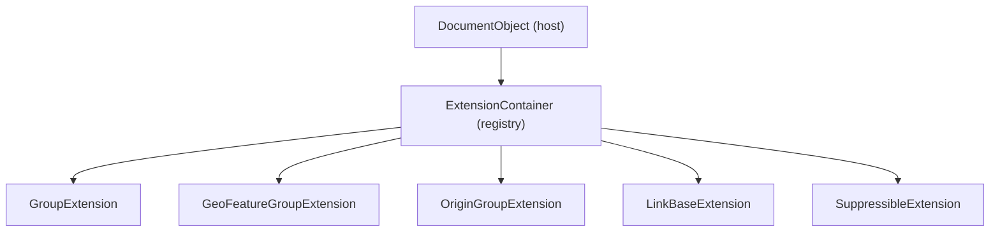
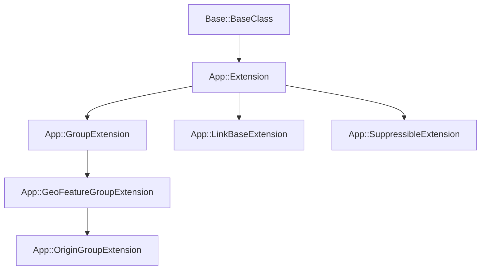
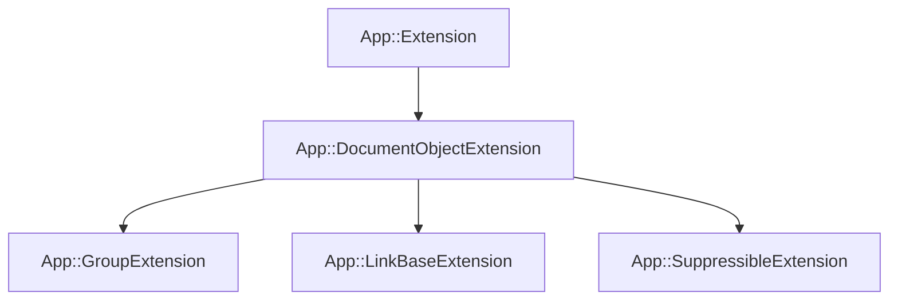

<!--
SPDX-License-Identifier: LGPL-2.1-or-later

FreeCAD Developer Guide 07
Extensions and Links

Audience: C++ developers who already understand DocumentObjects and properties.
Scope: App-layer extension system (composition) + the Link feature and link properties.
Non-scope: DocumentObject basics, build instructions.
-->

# 07. Extensions and Links

Extensions are FreeCAD's composition mechanism for `App::DocumentObject` behavior.
They let you attach reusable capabilities (grouping, origins, suppression, linking) without turning every feature into a deep inheritance tree.
This guide focuses on the App layer implementation (headers in `src/App/`) and the `Link` feature (in `src/App/Link.h` plus `src/App/PropertyLinks.h`).
Key files:

- `src/App/Extension.h`
- `src/App/ExtensionContainer.h`
- `src/App/DocumentObjectExtension.h`
- `src/App/GroupExtension.h`
- `src/App/GeoFeatureGroupExtension.h`
- `src/App/OriginGroupExtension.h`
- `src/App/SuppressibleExtension.h`
- `src/App/Link.h`
- `src/App/PropertyLinks.h`

## 1. What are Extensions?

From `src/App/Extension.h` and `src/App/ExtensionContainer.h`:

- Extensions provide composable behavior to `App::DocumentObject` instances.
- They are the alternative to multiple inheritance of feature classes.
- The extension is a separate object (its own type system + optional properties), attached to a host object.
- Most built-in extensions inherit from `App::Extension` (often through `App::DocumentObjectExtension`), not from `App::DocumentObject`.
- An `ExtensionContainer` holds a registry (map) from extension type id to `Extension*`.

The mental model:



The crucial design outcome is that a feature can stay focused on its domain logic and "opt in" to common behaviors by attaching extensions.

## 2. Extension Class Hierarchy

Core hierarchy you will see in practice:



In the headers there is also a bridging base used by many built-in extensions:



`DocumentObjectExtension` is what connects an extension instance to its host `DocumentObject` and provides host-facing hooks.

## 3. ExtensionContainer (`src/App/ExtensionContainer.h`)

An `ExtensionContainer` is a `PropertyContainer` that owns extensions.
Conceptually it is "the extension registry" embedded in an object.
API shape (simplified to the methods most code cares about):

```cpp
class AppExport ExtensionContainer : public App::PropertyContainer {
    PROPERTY_HEADER_WITH_OVERRIDE();
public:
    void addExtension(Base::Type extensionId, Extension* ext);
    Extension* getExtension(Base::Type extensionId) const;
    template <typename T> T* getExtension() const;
    bool hasExtension(Base::Type extensionId) const;

    std::vector<Extension*> getExtensions() const;
};
```

Typical host-side usage patterns:

```cpp
// Query by explicit type id.
auto* ext = obj->getExtension(App::GroupExtension::getExtensionClassTypeId());
if (ext) {
    auto* group = static_cast<App::GroupExtension*>(ext);
    // group->addObject(...)
}

// Template helper (when exposed by the container).
if (auto* group = obj->getExtension<App::GroupExtension>()) {
    // group->getObjects()
}
```

The storage key is a `Base::Type` (runtime type id) rather than a string name.
That makes lookup fast and stable across renames.

When a host class itself uses extension property tables, you'll also see helper macros (from `src/App/ExtensionContainer.h`):

```cpp
#define PROPERTY_SOURCE_WITH_EXTENSIONS(_class_, _parentclass_) \
    EXTENSION_PROPERTY_SOURCE(_class_, _parentclass_) \
    PROPERTY_SOURCE(_class_, _parentclass_)
```

## 4. EXTENSION_TYPESYSTEM Macros (`src/App/Extension.h`)

Extensions participate in FreeCAD's type system, but they are not the same as "normal" `TYPESYSTEM_*` for `DocumentObject`.
They have their own macros because their init/registration and property data chain is separate from the host object's `PropertyData`.
The macro forms you will run into are (excerpted):

```cpp
// In header:
#define EXTENSION_TYPESYSTEM_HEADER() \
public: \
    static Base::Type getExtensionTypeId(); \
    virtual Base::Type getExtensionId() const; \
    static void init(); \
private: \
    static Base::Type extensionTypeId

#define EXTENSION_PROPERTY_HEADER(_class_) \
    EXTENSION_TYPESYSTEM_HEADER(); \
protected: \
    static const App::PropertyData * getPropertyDataPtr(void); \
    const App::PropertyData &getPropertyData(void) const override; \
private: \
    static App::PropertyData propertyData
```

The intent is consistent: distinct extension type id + extension-owned `PropertyData` chain + `init()` registration.

## 5. EXTENSION_TYPESYSTEM_SOURCE Macro

The source-side macro registers the extension type as an "extension subclass".
The shape you may see documented is:

```cpp
#define EXTENSION_TYPESYSTEM_SOURCE(_class_) \
    TYPESYSTEM_SOURCE_P(_class_) \
    Base::Type _class_::getExtensionTypeId(void) \
        { return classTypeId; } \
    Base::Type _class_::getExtensionId(void) const \
        { return classTypeId; } \
    void _class_::init(void) { \
        initSubclass(_class_::classTypeId, #_class_, "App::Extension", &(_class_::create)); \
    }
```

On this branch the registration uses an extension-specific helper (often named `initExtensionSubclass(...)`).

## 6. GroupExtension (Grouping Objects)

`App::GroupExtension` gives a host object a standard "group" behavior.
The extension owns the `Group` property which is a list of links to grouped objects.
Core API and data (from `src/App/GroupExtension.h`):

```cpp
class AppExport GroupExtension : public App::Extension {
    EXTENSION_PROPERTY_HEADER(GroupExtension);
public:
    std::vector<DocumentObject*> getObjects() const;
    void addObject(DocumentObject* obj);
    void removeObject(DocumentObject* obj);
    bool hasObject(DocumentObject* obj) const;

    App::PropertyLinkList Group;  // Links to grouped objects
};
```

Concrete usage in a host object:

```cpp
class MyGroupHost : public App::DocumentObject
{
    PROPERTY_HEADER_WITH_OVERRIDE(MyMod::MyGroupHost);
public:
    MyGroupHost();
};

MyGroupHost::MyGroupHost()
{
    App::GroupExtension::initExtension(this);

    auto* group = getExtension<App::GroupExtension>();
    if (group) {
        // group->addObject(...)
    }
}
```

The same idea sometimes appears as a macro-only pattern in older examples:

```cpp
// Usage in DocumentObject:
PROPERTY_SOURCE_WITH_EXTENSIONS(MyMod::MyGroup, App::DocumentObject)
MyGroup::MyGroup() {
    EXTENSION_ADD_GROUP(MyMod::MyGroup);
}
```

Macro names differ between branches; the stable concept is "attach `GroupExtension` to the host during construction".

## 7. GeoFeatureGroupExtension (CSG Groups)

`App::GeoFeatureGroupExtension` extends grouping with coordinate system awareness.
The group has a `Placement`, and objects in the group are interpreted relative to the group's placement.
Conceptual API shape (from `src/App/GeoFeatureGroupExtension.h`):

```cpp
class AppExport GeoFeatureGroupExtension : public GroupExtension {
    EXTENSION_PROPERTY_HEADER(GeoFeatureGroupExtension);
public:
    App::PropertyPlacement Placement;
    Base::Placement getGroupPlacement() const;
};
```

## 8. OriginGroupExtension (PartDesign Bodies)

`App::OriginGroupExtension` builds on `GeoFeatureGroupExtension` and adds an `Origin` link.
That origin is an object (typically `App::Origin`) that contains axes and planes.

From `src/App/OriginGroupExtension.h`:

```cpp
class AppExport OriginGroupExtension: public App::GeoFeatureGroupExtension
{
    EXTENSION_PROPERTY_HEADER_WITH_OVERRIDE(App::OriginGroupExtension);
public:
    PropertyLink Origin;
};
```

### How it is used by PartDesign bodies

The PartDesign body pattern is implemented via the Part module base class.
The inheritance shape:

```text
Part::BodyBase : public Part::Feature, public App::OriginGroupExtension
  \- PartDesign::Body : public Part::BodyBase
```

`Part::BodyBase` attaches the extension in its constructor (from `src/Mod/Part/App/BodyBase.cpp`):

```cpp
BodyBase::BodyBase()
{
    ADD_PROPERTY(Tip, (nullptr));
    Tip.setScope(App::LinkScope::Child);

    ADD_PROPERTY(BaseFeature, (nullptr));

    App::OriginGroupExtension::initExtension(this);
}
```

The origin creation is implemented by the extension itself (from `src/App/OriginGroupExtension.cpp`):

```cpp
void OriginGroupExtension::onExtendedSetupObject()
{
    App::Document* doc = getExtendedObject()->getDocument();

    App::DocumentObject* originObj = getLocalizedOrigin(doc);

    assert(originObj && originObj->isDerivedFrom<App::Origin>());
    Origin.setValue(originObj);

    GeoFeatureGroupExtension::onExtendedSetupObject();
}

App::DocumentObject* OriginGroupExtension::getLocalizedOrigin(App::Document* doc)
{
    auto* originObject = doc->addObject<App::Origin>("Origin");
    QByteArray byteArray = tr("Origin").toUtf8();
    originObject->Label.setValue(byteArray.constData());
    return originObject;
}
```

In other words:

- The host opts in by calling `OriginGroupExtension::initExtension(this)`.
- The extension ensures the `Origin` link points to a real `App::Origin` object.

## 9. LinkBaseExtension (The Link Feature)

The Link feature is implemented as a DocumentObject plus a link extension.
The extension encapsulates the "linking" behavior and link-related properties.

Conceptual API shape (from `src/App/Link.h`):

```cpp
class AppExport LinkBaseExtension : public App::Extension {
    EXTENSION_PROPERTY_HEADER(LinkBaseExtension);
public:
    App::PropertyXLink LinkedObject;   // The linked target
    App::PropertyPlacement Placement;  // Local transform

    DocumentObject* getLinkedObject(bool recursive=false) const;
    void setLinkedObject(DocumentObject* obj);
};
```

In the actual header the extension derives from `App::DocumentObjectExtension` and includes additional internal properties and helpers.
The key idea remains:

- A link references a target object (sometimes with sub-element names).
- A link can apply a local transform (placement) relative to the target.

### Minimal usage from C++

```cpp
App::Document* doc = /* ... */;

auto* box = doc->addObject("Part::Box", "Box");
auto* link = doc->addObject("App::Link", "Link");

auto* linkExt = link->getExtension<App::LinkBaseExtension>();
if (linkExt) {
    linkExt->setLinkedObject(box);
    linkExt->Placement.setValue(Base::Placement(Base::Vector3d(10, 0, 0), Base::Rotation()));
}
```

The actual linkage in FreeCAD is stored via link properties (`PropertyLink*` and `PropertyXLink*`), covered in section 11.

## 10. LinkScope (Cross-Document and Hierarchical Linking)

Link properties support a scope concept that constrains which targets are considered valid and how dependencies are computed.

Enum excerpt (from `src/App/PropertyLinks.h`):

````cpp
enum LinkScope {
    LinkScope_Local = 0,   // Same document only
    LinkScope_Child,       // Child documents (assemblies)
    LinkScope_Global,      // Any document
    LinkScope_Hidden       // Internal links
};
Concrete usage example (from `src/Mod/Part/App/BodyBase.cpp`):

```cpp
ADD_PROPERTY(Tip, (nullptr));
Tip.setScope(App::LinkScope::Child);
````

That makes `Tip` valid across child group boundaries in a body/group structure.

## 11. Link Properties (`src/App/PropertyLinks.h`)

The link system is ultimately built on property types.
You choose the property class based on:

- single target vs list
- plain object vs object + sub-elements
- local document vs external document
- scope (local/child/global/hidden)

Core property types:

```cpp
// Single object link
App::PropertyLink Link;

// Link + sub-elements (faces, edges)
App::PropertyLinkSub LinkSub;  // (object, ["Face1", "Edge2"])

// Multiple links
App::PropertyLinkList LinkList;

// Cross-document link
App::PropertyXLink XLink;
```

Sub-element list variants exist when you want "many targets, each with subnames":

```cpp
App::PropertyLinkSubList LinksWithSubnames;
App::PropertyXLinkSubList ExternalLinksWithSubnames;
```

## 12. Practical Example: Using Extensions (PartDesign::Body)

This example ties together grouping + origin + scoped links. Canonical skeleton:

```cpp
// Body.h
#include <App/GeoFeatureGroupExtension.h>
#include <App/OriginGroupExtension.h>

class PartDesignExport Body : public Part::BodyBase {
    EXTENSION_ADD_GROUP(Body);
    PROPERTY_HEADER_WITH_OVERRIDE(PartDesign::Body);
public:
    Body();
    App::PropertyLink Origin;

protected:
    void setupOrigin();
};

// Body.cpp
PROPERTY_SOURCE(PartDesign::Body, Part::BodyBase)

Body::Body() {
    ADD_PROPERTY_TYPE(Origin, (nullptr), "Base", App::Prop_None, "Origin");
    setupOrigin();
}

void Body::setupOrigin() {
    if (!Origin.getValue()) {
        // Create origin with axes and planes
        App::Document* doc = getDocument();
        App::DocumentObject* origin = doc->addObject(
            "App::Origin", "Origin");
        Origin.setValue(origin);
    }
}
```

On this branch the origin is created by `OriginGroupExtension` (section 8), and the host opts in via `initExtension(this)`.
Also note how a scoped link is used in `Part::BodyBase`:

```cpp
ADD_PROPERTY(Tip, (nullptr));
Tip.setScope(App::LinkScope::Child);
```

That is a direct example of how extensions and link properties are used together.

## 13. SuppressibleExtension

`App::SuppressibleExtension` adds a `Suppressed` boolean flag to a host object.
Suppressed objects are skipped during recompute in contexts where suppression is supported.

From `src/App/SuppressibleExtension.h`:

```cpp
class SuppressibleExtension : public App::Extension {
    EXTENSION_PROPERTY_HEADER(SuppressibleExtension);
public:
    App::PropertyBool Suppressed;
};
```

Concrete host usage pattern:

```cpp
MyFeature::MyFeature()
{
    App::SuppressibleExtension::initExtension(this);
}

short MyFeature::mustExecute() const
{
    if (auto* sup = getExtension<App::SuppressibleExtension>()) {
        if (sup->Suppressed.getValue()) {
            return 0; // treated as not needing execution
        }
    }
    return App::DocumentObject::mustExecute();
}
```

Where suppression matters most:

- Large assembly-like graphs where recompute cost dominates.
- Feature pipelines where temporary disabling is needed without deleting objects.
