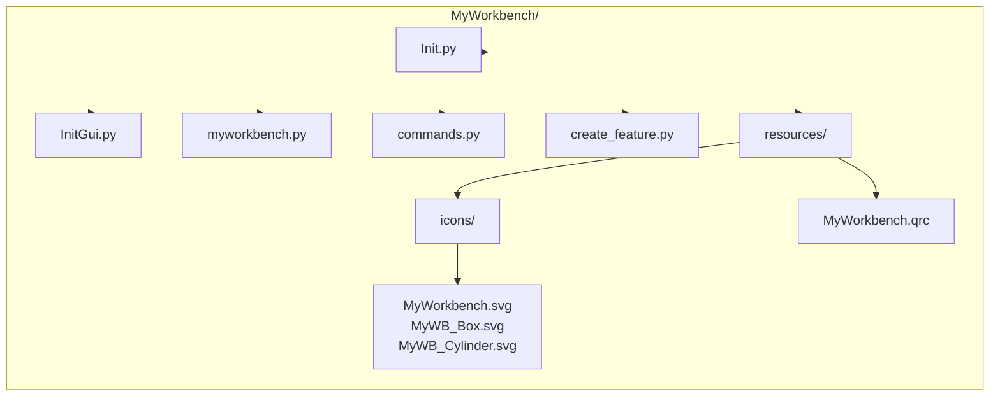
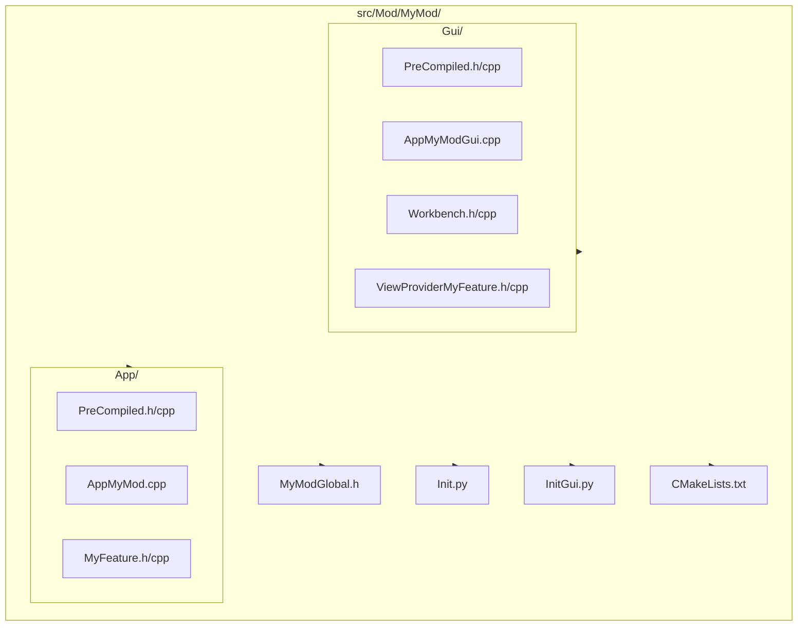

<!--
SPDX-License-Identifier: LGPL-2.1-or-later
-->

# 11. Creating A New Workbench

Capstone: build a complete workbench from scratch in two variants: Python-only (FeaturePython) and C++ (compiled App + Gui module).

## 1. Workbench Planning

Decide before coding: domain, base (Part or new types), language (Python vs C++), location (in-tree, contrib-like, external addon).
This guide's example domain: Box (Length/Width/Height) and Cylinder (Radius/Height).

## 2. Python-Only Workbench (faster path)

### 2.1 Directory Structure



### 2.2 `Init.py` (headless-safe)

```python
# SPDX-License-Identifier: LGPL-2.1-or-later
import FreeCAD as App
App.Console.PrintLog("Loading MyWorkbench...\n")
```

### 2.3 `InitGui.py`

```python
# SPDX-License-Identifier: LGPL-2.1-or-later
import FreeCAD as App
if App.GuiUp:
    import FreeCADGui as Gui
    from myworkbench import MyWorkbench
    Gui.addWorkbench(MyWorkbench())
    App.Console.PrintLog("Loading MyWorkbench GUI...\n")
```

### 2.4 Workbench class (`myworkbench.py`)

```python
# SPDX-License-Identifier: LGPL-2.1-or-later
import os
import FreeCAD as App
if App.GuiUp:
    import FreeCADGui as Gui

def _icon(name: str) -> str:
    return os.path.join(os.path.dirname(__file__), "resources", "icons", name)

class MyWorkbench(Gui.Workbench):
    MenuText = "My Workbench"
    ToolTip = "Example workbench that creates parametric primitives"
    Icon = _icon("MyWorkbench.svg")

    def Initialize(self):
        import commands  # noqa: F401
        cmds = ["MyWB_CreateBox", "MyWB_CreateCylinder"]
        self.appendMenu("MyWorkbench", cmds)
        self.appendToolbar("MyWorkbench", cmds)

    def GetClassName(self):
        return "Gui::PythonWorkbench"
```

### 2.5 FeaturePython objects (`create_feature.py`)

```python
# SPDX-License-Identifier: LGPL-2.1-or-later
import FreeCAD as App
import Part

class _NoPickle:
    def dumps(self): return None
    def loads(self, state): _ = state

class SimpleBox(_NoPickle):
    Type = "MyWB_SimpleBox"
    def __init__(self, obj):
        obj.Proxy = self
        obj.addProperty("App::PropertyLength", "Length", "Box", "Box length")
        obj.addProperty("App::PropertyLength", "Width", "Box", "Box width")
        obj.addProperty("App::PropertyLength", "Height", "Box", "Box height")
        obj.Length, obj.Width, obj.Height = 10.0, 10.0, 10.0
    def execute(self, obj):
        l, w, h = obj.Length.Value, obj.Width.Value, obj.Height.Value
        if l <= 0.0 or w <= 0.0 or h <= 0.0:
            App.Console.PrintError("MyWorkbench: box dimensions must be positive\n")
            obj.Shape = Part.Shape(); return
        obj.Shape = Part.makeBox(l, w, h)

class ViewProviderSimpleBox(_NoPickle):
    def __init__(self, vobj): vobj.Proxy = self
    def getIcon(self): return "Part_Box"

class SimpleCylinder(_NoPickle):
    Type = "MyWB_SimpleCylinder"
    def __init__(self, obj):
        obj.Proxy = self
        obj.addProperty("App::PropertyLength", "Radius", "Cylinder", "Cylinder radius")
        obj.addProperty("App::PropertyLength", "Height", "Cylinder", "Cylinder height")
        obj.Radius, obj.Height = 5.0, 10.0
    def execute(self, obj):
        r, h = obj.Radius.Value, obj.Height.Value
        if r <= 0.0 or h <= 0.0:
            App.Console.PrintError("MyWorkbench: cylinder dimensions must be positive\n")
            obj.Shape = Part.Shape(); return
        obj.Shape = Part.makeCylinder(r, h)

class ViewProviderSimpleCylinder(_NoPickle):
    def __init__(self, vobj): vobj.Proxy = self
    def getIcon(self): return "Part_Cylinder"

def _doc():
    doc = App.ActiveDocument
    return doc if doc else App.newDocument()

def create_simple_box(name: str = "Box"):
    doc = _doc(); obj = doc.addObject("Part::FeaturePython", name)
    SimpleBox(obj)
    if App.GuiUp: ViewProviderSimpleBox(obj.ViewObject)
    doc.recompute(); return obj

def create_simple_cylinder(name: str = "Cylinder"):
    doc = _doc(); obj = doc.addObject("Part::FeaturePython", name)
    SimpleCylinder(obj)
    if App.GuiUp: ViewProviderSimpleCylinder(obj.ViewObject)
    doc.recompute(); return obj
```

### 2.6 Commands (`commands.py`)

```python
# SPDX-License-Identifier: LGPL-2.1-or-later
import os
import FreeCAD as App
if App.GuiUp:
    import FreeCADGui as Gui
from create_feature import create_simple_box, create_simple_cylinder

def _icon(name: str) -> str:
    return os.path.join(os.path.dirname(__file__), "resources", "icons", name)

class _Cmd:
    def __init__(self, pix, text, tip, accel, fn):
        self._pix, self._text, self._tip, self._accel, self._fn = pix, text, tip, accel, fn
    def GetResources(self):
        return {"Pixmap": self._pix, "MenuText": self._text, "ToolTip": self._tip, "Accel": self._accel}
    def Activated(self): self._fn()
    def IsActive(self): return True

if App.GuiUp:
    Gui.addCommand("MyWB_CreateBox", _Cmd(_icon("MyWB_Box.svg"), "Create Box", "Create a parametric box", "Ctrl+B", create_simple_box))
    Gui.addCommand(
        "MyWB_CreateCylinder",
        _Cmd(_icon("MyWB_Cylinder.svg"), "Create Cylinder", "Create a parametric cylinder", "Ctrl+Shift+C", create_simple_cylinder),
    )
```

### 2.7 Install and test

1. Copy `MyWorkbench/` into your user `Mod/` directory.
2. Restart FreeCAD.
3. Switch to "My Workbench" and run both commands.

## 3. C++ Workbench (compiled App + Gui)

This variant builds as an in-tree module under `src/Mod/MyMod/`.

### 3.1 Directory Structure



### 3.2 Export macros (`MyModGlobal.h`)

```cpp
// SPDX-License-Identifier: LGPL-2.1-or-later
#pragma once
#include <FCGlobal.h>
#ifndef MyModExport
# ifdef MyMod_EXPORTS
#  define MyModExport FREECAD_DECL_EXPORT
# else
#  define MyModExport FREECAD_DECL_IMPORT
# endif
#endif
#ifndef MyModGuiExport
# ifdef MyModGui_EXPORTS
#  define MyModGuiExport FREECAD_DECL_EXPORT
# else
#  define MyModGuiExport FREECAD_DECL_IMPORT
# endif
#endif
```

### 3.3 PreCompiled headers (App and Gui)

Create these files in both `App/` and `Gui/` (same contents):

```cpp
// SPDX-License-Identifier: LGPL-2.1-or-later
#pragma once
#include <FCConfig.h>
```

```cpp
// SPDX-License-Identifier: LGPL-2.1-or-later
#include <PreCompiled.h>
```

### 3.4 App object (`App/MyFeature.h`, `App/MyFeature.cpp`)

`App/MyFeature.h`:

```cpp
// SPDX-License-Identifier: LGPL-2.1-or-later
#pragma once

#include <Mod/MyMod/MyModGlobal.h>
#include <App/PropertyUnits.h>
#include <Mod/Part/App/PartFeature.h>

namespace MyMod
{
class MyModExport MyFeature : public Part::Feature
{
    PROPERTY_HEADER_WITH_OVERRIDE(MyMod::MyFeature);
public:
    MyFeature();
    App::PropertyLength Length, Width, Height;
    App::DocumentObjectExecReturn* execute() override;
    const char* getViewProviderName() const override { return "MyModGui::ViewProviderMyFeature"; }
};
}  // namespace MyMod
```

`App/MyFeature.cpp`:

```cpp
// SPDX-License-Identifier: LGPL-2.1-or-later
#include <PreCompiled.h>

#include <Mod/MyMod/App/MyFeature.h>

#include <BRepPrimAPI_MakeBox.hxx>
#include <Standard_Failure.hxx>

using namespace MyMod;
PROPERTY_SOURCE(MyMod::MyFeature, Part::Feature)

MyFeature::MyFeature()
{
    ADD_PROPERTY_TYPE(Length, (10.0), "Box", App::Prop_None, "Length of the box");
    ADD_PROPERTY_TYPE(Width, (10.0), "Box", App::Prop_None, "Width of the box");
    ADD_PROPERTY_TYPE(Height, (10.0), "Box", App::Prop_None, "Height of the box");
}

App::DocumentObjectExecReturn* MyFeature::execute()
{
    const double l = Length.getValue(), w = Width.getValue(), h = Height.getValue();
    if (l <= 0.0 || w <= 0.0 || h <= 0.0) {
        return new App::DocumentObjectExecReturn("Length, Width, Height must be positive");
    }
    try {
        Shape.setValue(BRepPrimAPI_MakeBox(l, w, h).Shape());
        return StdReturn;
    }
    catch (Standard_Failure& e) {
        const char* msg = e.GetMessageString();
        return new App::DocumentObjectExecReturn(msg ? msg : "OCCT failure");
    }
}
```

### 3.5 App Python module entry (`App/AppMyMod.cpp`)

This makes `import MyMod` work and registers your types.

```cpp
// SPDX-License-Identifier: LGPL-2.1-or-later
#include <Base/Console.h>
#include <Base/Interpreter.h>
#include <Base/PyObjectBase.h>

#include <Mod/MyMod/App/MyFeature.h>

namespace MyMod
{
class Module : public Py::ExtensionModule<Module>
{
public:
    Module() : Py::ExtensionModule<Module>("MyMod") { initialize("MyMod App module"); }
};
}

PyMOD_INIT_FUNC(MyMod)
{
    try { Base::Interpreter().runString("import Part"); }
    catch (const Base::Exception& e) { PyErr_SetString(PyExc_ImportError, e.what()); PyMOD_Return(nullptr); }

    PyObject* mod = Base::Interpreter().addModule(new MyMod::Module);
    Base::Console().log("Loading MyMod module... done\n");
    MyMod::MyFeature::init();
    PyMOD_Return(mod);
}
```

### 3.6 ViewProvider (`Gui/ViewProviderMyFeature.h`, `.cpp`)

Inherit from `PartGui::ViewProviderPart` for an immediate working display.

```cpp
// SPDX-License-Identifier: LGPL-2.1-or-later
#pragma once

#include <Mod/MyMod/MyModGlobal.h>
#include <QIcon>
#include <Mod/Part/Gui/ViewProvider.h>

namespace MyModGui
{
class MyModGuiExport ViewProviderMyFeature : public PartGui::ViewProviderPart
{
    PROPERTY_HEADER_WITH_OVERRIDE(MyModGui::ViewProviderMyFeature);
public:
    QIcon getIcon() const override;
};
}  // namespace MyModGui
```

```cpp
// SPDX-License-Identifier: LGPL-2.1-or-later
#include <PreCompiled.h>

#include <Mod/MyMod/Gui/ViewProviderMyFeature.h>

#include <Gui/BitmapFactory.h>

using namespace MyModGui;
PROPERTY_SOURCE(MyModGui::ViewProviderMyFeature, PartGui::ViewProviderPart)
QIcon ViewProviderMyFeature::getIcon() const { return Gui::BitmapFactory().iconFromTheme("Part_Box"); }
```

### 3.7 Gui module entry + command (`Gui/AppMyModGui.cpp`)

This registers the command and a minimal GUI workbench selector entry.

```cpp
// SPDX-License-Identifier: LGPL-2.1-or-later
#include <Base/Console.h>
#include <Base/Interpreter.h>
#include <Base/PyObjectBase.h>

#include <Gui/Application.h>
#include <Gui/Command.h>

#include <Mod/MyMod/Gui/ViewProviderMyFeature.h>
#include <Mod/MyMod/Gui/Workbench.h>

class CmdMyModCreateBox : public Gui::Command
{
public:
    CmdMyModCreateBox() : Command("MyMod_CreateBox")
    {
        sAppModule = "MyMod";
        sGroup = "MyMod";
        sMenuText = QT_TR_NOOP("Create Box");
        sToolTipText = QT_TR_NOOP("Create a parametric box");
        sStatusTip = sToolTipText;
        sPixmap = "Part_Box";
    }
    void activated(int) override
    {
        openCommand("MyMod Create Box");
        doCommand(Gui::Command::Doc, "import MyMod");
        doCommand(Gui::Command::Doc, "import FreeCAD as App");
        doCommand(Gui::Command::Doc, "App.activeDocument().addObject('MyMod::MyFeature','Box')");
        doCommand(Gui::Command::Doc, "App.activeDocument().recompute()");
        commitCommand(); updateActive();
    }
    bool isActive() override { return hasActiveDocument(); }
};

namespace MyModGui
{
class Module : public Py::ExtensionModule<Module>
{
public:
    Module() : Py::ExtensionModule<Module>("MyModGui") { initialize("MyModGui module"); }
};
}

PyMOD_INIT_FUNC(MyModGui)
{
    if (!Gui::Application::Instance) {
        PyErr_SetString(PyExc_ImportError, "Cannot load MyModGui in console application.");
        PyMOD_Return(nullptr);
    }
    try { Base::Interpreter().runString("import MyMod"); }
    catch (const Base::Exception& e) { PyErr_SetString(PyExc_ImportError, e.what()); PyMOD_Return(nullptr); }

    PyObject* mod = Base::Interpreter().addModule(new MyModGui::Module);
    Base::Console().log("Loading MyModGui module... done\n");

    Gui::Application::Instance->commandManager().addCommand(new CmdMyModCreateBox());
    MyModGui::ViewProviderMyFeature::init();
    MyModGui::Workbench::init();
    PyMOD_Return(mod);
}
```

### 3.8 C++ workbench class (`Gui/Workbench.h`, `Gui/Workbench.cpp`)

`Gui/Workbench.h`:

```cpp
// SPDX-License-Identifier: LGPL-2.1-or-later
#pragma once

#include <Mod/MyMod/MyModGlobal.h>
#include <Gui/StdWorkbench.h>

namespace MyModGui
{
class MyModGuiExport Workbench : public Gui::StdWorkbench
{
    TYPESYSTEM_HEADER_WITH_OVERRIDE();
protected:
    Gui::MenuItem* setupMenuBar() const override;
    Gui::ToolBarItem* setupToolBars() const override;
};
}  // namespace MyModGui
```

`Gui/Workbench.cpp`:

```cpp
// SPDX-License-Identifier: LGPL-2.1-or-later
#include <PreCompiled.h>

#include <Mod/MyMod/Gui/Workbench.h>

#include <Gui/MenuItem.h>
#include <Gui/ToolBarItem.h>

using namespace MyModGui;
TYPESYSTEM_SOURCE(MyModGui::Workbench, Gui::StdWorkbench)

Gui::MenuItem* Workbench::setupMenuBar() const
{
    Gui::MenuItem* root = Gui::StdWorkbench::setupMenuBar();
    auto* m = new Gui::MenuItem;
    m->setCommand("&MyMod");
    *m << "MyMod_CreateBox";
    root->appendItem(m);
    return root;
}

Gui::ToolBarItem* Workbench::setupToolBars() const
{
    Gui::ToolBarItem* root = Gui::StdWorkbench::setupToolBars();
    auto* tb = new Gui::ToolBarItem(root);
    tb->setCommand("MyMod");
    *tb << "MyMod_CreateBox";
    return root;
}
```

### 3.9 `Init.py`, `InitGui.py`

`Init.py`:

```python
# SPDX-License-Identifier: LGPL-2.1-or-later
import FreeCAD as App
App.Console.PrintLog("Loading MyMod (Init.py)\n")
import MyMod  # noqa: F401
```

`InitGui.py` (Python workbench entry that loads the GUI module and shows the command):

```python
# SPDX-License-Identifier: LGPL-2.1-or-later
import FreeCAD as App
if App.GuiUp:
    import FreeCADGui as Gui

class MyModWorkbench(Gui.Workbench):
    MenuText = "MyMod"
    ToolTip = "Example compiled module"
    Icon = ""
    def Initialize(self):
        import MyModGui  # noqa: F401
    def GetClassName(self):
        return "MyModGui::Workbench"

Gui.addWorkbench(MyModWorkbench())
```

### 3.10 CMakeLists.txt (module root)

Minimal in-tree wiring (also add `add_subdirectory(MyMod)` in `src/Mod/CMakeLists.txt`).

```cmake
# SPDX-License-Identifier: LGPL-2.1-or-later

set(MyMod_Scripts Init.py)
if(BUILD_GUI)
    list(APPEND MyMod_Scripts InitGui.py)
endif()

add_custom_target(MyModScripts ALL SOURCES ${MyMod_Scripts})
fc_target_copy_resource(MyModScripts
    ${CMAKE_CURRENT_SOURCE_DIR}
    ${CMAKE_BINARY_DIR}/Mod/MyMod
    ${MyMod_Scripts}
)
install(FILES ${MyMod_Scripts} DESTINATION Mod/MyMod)

set(MyMod_App_SRCS
    App/PreCompiled.h App/PreCompiled.cpp
    App/AppMyMod.cpp
    App/MyFeature.h App/MyFeature.cpp
)
add_library(MyMod SHARED ${MyMod_App_SRCS})
target_include_directories(MyMod PRIVATE ${CMAKE_BINARY_DIR} ${CMAKE_BINARY_DIR}/src ${CMAKE_SOURCE_DIR}/src ${CMAKE_CURRENT_BINARY_DIR})
target_link_libraries(MyMod Part FreeCADApp)
SET_BIN_DIR(MyMod MyMod /Mod/MyMod)
SET_PYTHON_PREFIX_SUFFIX(MyMod)
install(TARGETS MyMod DESTINATION ${CMAKE_INSTALL_LIBDIR})

if(BUILD_GUI)
    set(MyMod_Gui_SRCS
        Gui/PreCompiled.h Gui/PreCompiled.cpp
        Gui/AppMyModGui.cpp
        Gui/Workbench.h Gui/Workbench.cpp
        Gui/ViewProviderMyFeature.h Gui/ViewProviderMyFeature.cpp
    )
    add_library(MyModGui SHARED ${MyMod_Gui_SRCS})
    target_include_directories(MyModGui PRIVATE ${CMAKE_BINARY_DIR} ${CMAKE_BINARY_DIR}/src ${CMAKE_SOURCE_DIR}/src ${CMAKE_CURRENT_BINARY_DIR})
    target_link_libraries(MyModGui MyMod PartGui FreeCADGui)
    SET_BIN_DIR(MyModGui MyModGui /Mod/MyMod)
    SET_PYTHON_PREFIX_SUFFIX(MyModGui)
    install(TARGETS MyModGui DESTINATION ${CMAKE_INSTALL_LIBDIR})
endif()
```

## 4. Installing And Testing

Python-only: copy `MyWorkbench/` into a scanned `Mod/` directory, restart FreeCAD, switch to "My Workbench", run both commands.
C++: add `add_subdirectory(MyMod)` in `src/Mod/CMakeLists.txt`, configure/build FreeCAD, switch to `MyMod`, run `MyMod_CreateBox`.

## 5. Common Issues

- Workbench not found: wrong install folder (Python-only) or module not added to build (C++).
- Commands missing: command id mismatch or command not registered.
- Feature fails: negative dimensions, missing recompute, or `execute()` returns error.
- ViewProvider missing (C++): `getViewProviderName()` mismatch or `::init()` not called.
