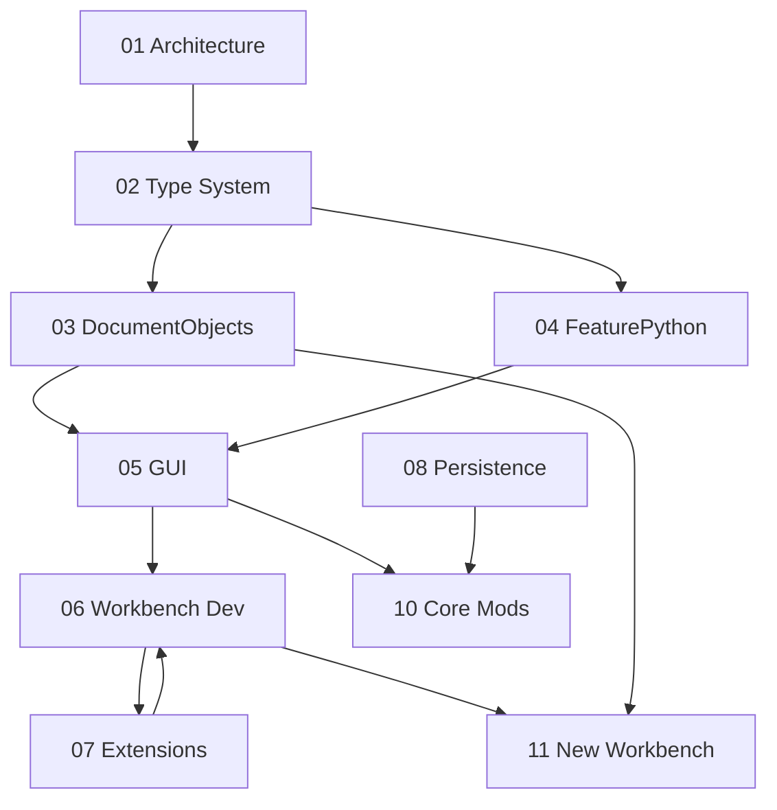

<!--
SPDX-License-Identifier: LGPL-2.1-or-later

FreeCAD Developer Guide Index
A comprehensive knowledge base for FreeCAD developers.
-->

# FreeCAD Developer Guide

A comprehensive knowledge base for developers who want to understand, modify, or extend FreeCAD. These guides assume you know C++ and Python but are new to FreeCAD's codebase.

## Quick Start

**New to FreeCAD?** Start with the architecture overview, then read guides based on what you want to do:

| Goal                       | Read These Guides                |
| -------------------------- | -------------------------------- |
| Understand the codebase    | 01 → 02 → 03                     |
| Add a Python feature       | 01 → 02 → 04 → 11                |
| Modify core functionality  | 01 → 02 → 03 → 10                |
| Create GUI elements        | 01 → 02 → 05 → 10                |
| Build a new workbench      | 01 → 02 → 03 → 04 → 05 → 06 → 11 |
| Work with assemblies/links | 01 → 02 → 03 → 07                |

## The Guides

### 01. Architecture Overview

**File:** `01-architecture-overview.md`

The foundation. Explains FreeCAD's three-layer architecture (Base → App → Gui → Mod), the 34 workbenches, directory structure, and bootstrap sequence. Essential reading before any other guide.

### 02. Type System and Properties

**File:** `02-type-system-and-properties.md`

FreeCAD's custom RTTI system and property framework. Covers `Base::Type`, `BaseClass`, `TYPESYSTEM` macros, `PROPERTY_HEADER`, `ADD_PROPERTY`, and common property types. Required for understanding how DocumentObjects work.

### 03. Document Objects

**File:** `03-document-objects.md`

The core parametric object system. Explains `DocumentObject` lifecycle, `execute()`, the dependency DAG, `mustExecute()`, `onChanged()`, status bits, and signals. Essential for anyone creating new features.

### 04. FeaturePython and Python Bindings

**File:** `04-python-features.md`

Creating DocumentObjects in pure Python without C++ subclasses. Covers the FeaturePython proxy pattern, Python ViewProviders, the ClassPy.xml binding generation pipeline, and Python-only workbenches.

### 05. GUI, ViewProviders, and Commands

**File:** `05-gui-viewproviders-commands.md`

The Gui layer: ViewProviders for 3D visualization, Coin3D scene graphs, the Command framework, task panels, selection system, and tree view customization. Required for any UI work.

### 06. Workbench Development

**File:** `06-workbench-development.md`

How workbenches are organized: directory structure, `Init.py`/`InitGui.py`, C++ and Python workbench classes, menu/toolbar registration, context menus, and lazy loading patterns.

### 07. Extensions and Links

**File:** `07-extensions-and-links.md`

The extension system for composable behavior: `ExtensionContainer`, `GroupExtension`, `GeoFeatureGroupExtension`, `OriginGroupExtension`, `SuppressibleExtension`, and the Link feature for cross-document referencing.

### 08. Persistence and Transactions

**File:** `08-persistence-and-transactions.md`

How FreeCAD saves and loads documents: the .FCStd ZIP format, XML serialization, `Save()`/`Restore()` methods, `Writer`/`XMLReader`, and the undo/redo transaction system.

### 10. Modifying Core and UI

**File:** `10-modifying-core-and-ui.md`

Practical guide for developers modifying FreeCAD itself. Adding property types, DocumentObjects, ViewProviders, commands (C++ and Python), task panels, selection integration, and anti-patterns to avoid.

### 11. Creating A New Workbench

**File:** `11-creating-new-workbench.md`

Step-by-step capstone guide. Builds the same parametric primitives workbench twice: once in pure Python using FeaturePython, once in C++ with compiled App/Gui modules. Complete working examples you can compile and run.

## Guide Dependencies

## Key Conventions Used Throughout

- **Paths:** All paths are relative to the FreeCAD repository root
- **Namespaces:** `MyMod` = your module name, `MyModGui` = your GUI namespace
- **Code blocks:** Complete, minimal examples. Headers shown only when needed for context
- **SPDX headers:** Every new source file needs `// SPDX-License-Identifier: LGPL-2.1-or-later`

## Reading Tips

1. **Don't skip the early guides.** Architecture (01) and Type System (02) are prerequisites for everything else.

2. **Use the code examples.** Every concept has concrete code from the actual FreeCAD source.

3. **Cross-reference.** Guides link to each other and to key source files. Follow the links when you need more detail.

4. **Build and test.** The best way to understand is to compile and run the examples, especially in guide 11.

## Additional Resources

- **Developer Handbook:** https://freecad.github.io/DevelopersHandbook/
- **Wiki:** https://wiki.freecad.org
- **Forum:** https://forum.freecad.org
- **Source:** `src/Mod/TemplatePyMod/` — canonical FeaturePython examples

## License

These guides are part of FreeCAD documentation and follow the same license as FreeCAD source code: LGPL-2.1-or-later.

---

_Generated for FreeCAD developers. Start with guide 01 if you're new, or jump to the guide matching your current task._
